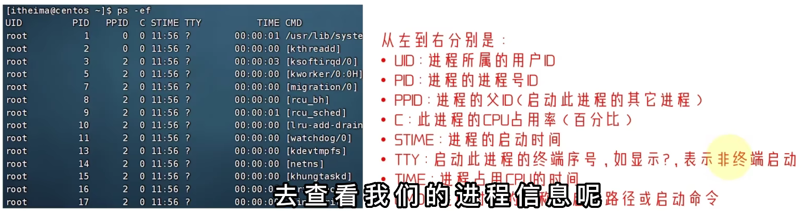
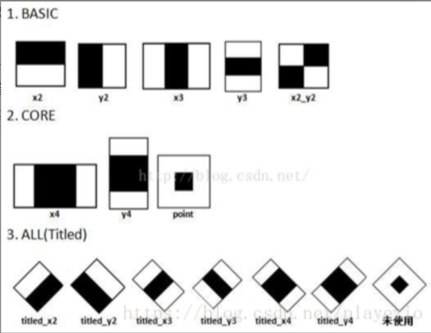
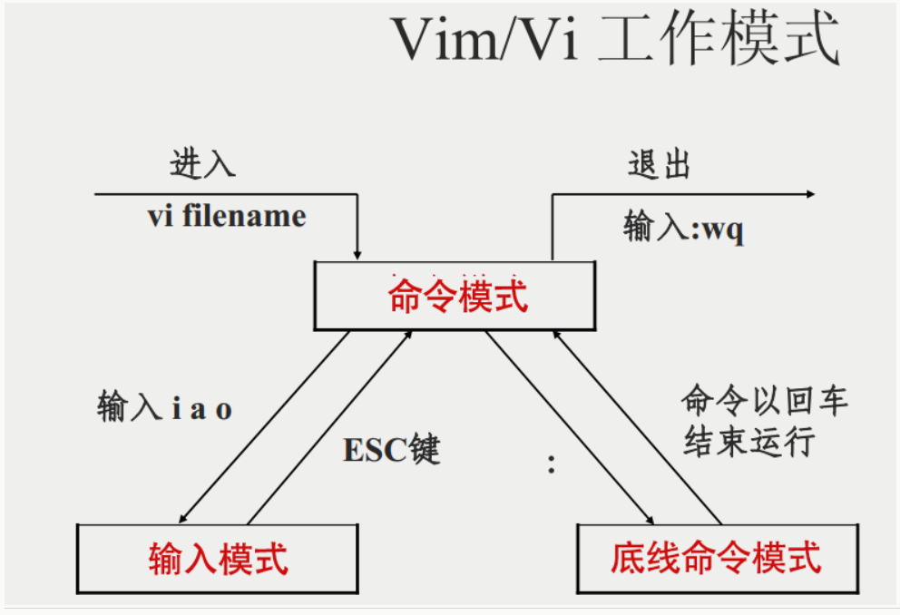

#   1、Linux操作系统

## 1、Linux目录结构

/ 根目录，只有一个。Linux用向左的斜杠表示

## 2、Linux命令

基础格式： **command [-options] [parameter]**

-options:可选，非必填； parameter：可选，命令参数

### 1、基础命令

#### 文件与目录操作：

##### ls

ls [-a -l -h] [路径]

-a all表示列出全部内容，包括隐藏选项（以 .开头的文件会被隐藏起来。不使用看不到）

-l 表示以竖向展示内容

-h 表示以易于阅读的形式列出文件内容，需要和l搭配

可以混用：ls -a-l ls -al ls -la ls -hl

当不用参数，表示以平铺的形式，展示当前工作目录下的内容


#####  cd

cd命令：（change directory）

cd [路径]

路径：绝对路径，以根目录为开头，相对路径，以当前工作目录为开头

特殊路径符：.表示当前目录，.. 表示上一级../.. 上两级，~表示home目录

cd / 切换到根目录，cd无路径，切换到用户home路径

cd命令无选项


常用命令：

```bash
# 切换到根目录
cd /
# 切换到当前目录的父目录
cd
# 切换到上一次访问的目录
cd -
# 切换到当前用户的主目录
cd ~
# 切换到指定目录（相对路径或绝对路径）
cd directory_name
```


##### pwd

pwd命令：（print work directory）

查看当前工作目录

无选项


##### mkdir

mkdir 命令：(make directory)

mkdir [-p] 路径

-p 创建多层级目录

ctrl + l 清屏

注：创建文件夹需要修改权限，在home目录内无权限问题


##### touch命令

修改文件或目录的时间属性、创建文件

touch 路径

创建文件：touch test.txt


##### cat /less/head/tail

cat 查看文件内容

**concatenate**

cat 路径


##### file

file命令可以深入分析文件内容，显示其具体类型和编码格式。

基本用法：file 文件名；


##### more

more 查看文件内容（空格翻页查看，q退出）


##### cp

复制文件、文件夹

cp [-r] 参数1 参数2

-r可选，用于复制文件夹使用，表示递归，

参数1，Linux路径，表示被复制的文件或文件夹

参数2，Linux路径，表示要复制的地方


##### mv

文件移动命令

mv 参数1 参数2

参数1，Linux路径，表示被移动的文件或文件夹

参数2，Linux路径，表示要移动的地方

可以用来改名 mv test2.txt test3.txt


##### rm 

文件删除命令

语法：rm [-r -f] 参数1，参数2，……参数n

-r用于删除文件夹， -f表示force强制删除，参数1-n表示要删除的文件路径

rm命令支持通配符 *模糊匹配 ： *匹配任意内容


##### tail

可以查看文件尾部内容，默认是10行

命令：tail [-f -n] linux路径

-f表示持续跟踪，-num 表示查看尾部多少行


#### 搜索与查找

##### which

查找命令


##### find

查找文件：

-name **按文件名查找文件**  语法：find 起始路径 -name “被查找的文件"

-size 按照文件大小查找文件 语法：find 起始路径 -size + | -n [KMG]

+、-表示大于和小于，n表示大小数字，KMG表示大小单位（Kb，Mb，Gb）


##### grep

文本搜索

从文件中通过关键字过滤文件行

语法：grep [-n] 关键字 文件路径

选项n 可选，表示在结果中显示匹配的行号，参数，关键字，必填，如果带有空格或其他特殊符号，建议使用” “包围起来。参数文件路径，必填 


##### locate 

快速查找文件


#### wc命令：做数量统计

语法：wc [-c -m -l -w]文件路径

选项：-c 统计bytes数量，-m统计字符数量，-l统计行数，-w统计单词数量，参数：文件路径


#### 管道符 | 

表示将左边的结果作为右边的输入

ep: ls -l /user/bin | wc -l ：统计bin下有多少个文件，ls /user/bin |grep gtf :从bin中过滤包含gtf的文件


#### echo命令：

可以使用echo命令在命令行内输出指定内容（类似编程语言中的print）

语法：echo 输出内容

反引号：`将内容作为命令结果输出


#### 重定向符：

">"：将左侧的命令结果，覆盖写到符号右侧指定的文件中，

">>"：将左侧的命令结果，追加写到符号右侧指定的文件中，

exp：echo "hello world" > test.txt


### 2、用户相关

vi/vim编辑器

使用vim编辑文件：命令：vi 文件路径

i：输入模式

：：底线模式，：wq保存退出

esc：退出输入模式


#### 切换用户su：（switch user）

语法： su [-] [用户名]

-符号是可选，表示切换用户后是否加载环境变量，建议带

用户名可以省略，省略表示root

切换后可以通过exit退回上一个用户，也可以用快捷键 CTRL + D

使用sudo命令，为普通的命令授权，临时以root身份执行。语法：sudo 其他命令。需要为普通用户配置sudo认证


#### 用户与用户组

创建用户组：

groupadd 用户组名

删除用户组：

groupdel 用户组名


#### 创建用户：

useradd [-g -d] 用户名

选项 -g 指定用户的组，不指定会创建同名组并自动加入，-d指定用户home路径，不指定，home目录默认在/home/用户名

删除用户：

userdel [-r] 用户名

选项 -r 删除用户的home目录，不使用r，删除用户时home保留

查看用户所属组

id[用户名] 如果不提供用户名则查看自身

修改用户组：

usermod -aG

getent 查看当前系统中有那些用户


### 3、权限相关

权限：r：可读，可查看文件内容，w：可写，可在文件夹内部创建，删除，修改等操作，x：可执行，针对文件夹，表示是否可cd 进入


#### chmod：修改权限

语法：chmod [-R] 权限 文件或文件夹；选项R表示对文件夹内所有内容应用相同操作。

ep：chmod u-rwx,g=rx,o=x test.txt

快捷方式：chmod xxx；r记为4，w记为2，x记为1

0：无任何权限，

1：仅有x权限；--x

2：仅有w权限；-w-

3：有w、x权限；-wx

4：仅有r权限；r--

5：有r、x权限；r-x

6：有r、w权限；rw-

7：有所有权限rwx


#### chown命令

修改文件、文件夹所属用户和用户组

语法：chown [-R] [用户] [:] [用户组] 文件或文件夹

-R同chmod，对文件夹内的所有文件应用相同的规则

普通用户无法修改所属为其他用户或用户组，所以此命令只能root用户执行。


ll命令：


第一行为例：

第1位：表示类型：d目录，l表示链接，b表示块设备，-表示普通文件，p表示管道文件，c表示设备文件，s表示套接字；

2-4位：表示所有者（user）权限；r可读，-不可写，x可执行

5-7位：表示所有组（group）权限；

8-10位：表示其他用户（other）权限；


### 4、快捷键：

Ctrl + C：强制停止

Ctrl + D：退出或登出

history：查看历史命令 （可以通过grep过滤某些命令）

P命令前缀：可以通过P命令前缀，自动执行最近上一次匹配前缀的命令

Ctrl + R：输入内容匹配历史命令


Ctrl + a：跳到命令开头；

Ctrl + e：跳到命令结尾；

Ctrl + 键盘左键：向左跳一个单词；

Ctrl + 键盘右键：向右跳一个单词；

Ctrl + L 或 clear ：清屏


### 5、Linux安装软件包

#### yum命令：（centOs）

语法：yum [-y] [install | remove | search] 软件名称

选项：-y 自动确认，无需手动确认安装或卸载，install 安装，remove：卸载，search：联网搜索

yum命令需要root权限，可以切换到su root，需要联网


#### apt命令（Ubuntu）

语法：apt [-y] [install | remove | search] 软件名称


### 6、服务相关

#### systemctl命令

linux系统很多软件支持使用systemctl命令控制：启动，停止，开机自启，能够被systemctl管理的软件，一般也被称之为：服务

语法：systemctl start | stop | status |enable | disable 服务名 启动、关闭、查看状态、开机自启、关闭开机自启

系统内置的服务很多，如：NetworkManger，主网服务，network，副网服务；firewalld 防火墙服务；sshd，ssh服务（远程登陆）

部分软件安装后不会集成到systemctl中，需要手动注册。


#### ln命令：

创建软连接（类似快捷方式）

语法：ln -s 参数1 参数2

选项：-s创建软连接，参数1 被链接的文件或文件夹，参数2：链接的目的地


### 7、时间相关

#### date命令：查看系统时间

语法：date [-d] [+格式化字符串]

-d 按照给定的字符串显示日期，一般用于时间计算，

格式化字符串：%Y年，%y年份后两位数字，%：月份，%d：日，%H：小时，%M：分钟，%S：秒，%s：自1970-01-01 00:00:00 UTC 到现在的秒数

例：date +%Y-%m-%d  如果格式字符串右特殊符号，需要用引号包围


#### 修改Linux时区：root权限

rm -f /etc/localtime

sudo ln -s /usr/share/zoneinfo/Asia/Shanghai /etc/localtime


#### npt程序：联网自动校准系统时间

安装并设置开机自启动


### 8、IP相关

主机名：hostname

修改主机名：hostnamectl set -hostname 修改的主机名

可以修改hosts文件做IP与域名映射，通过域名直接访问


#### 固定IP地址

DHCP动态获取IP地址，会频繁变化

子网掩码：两个网络地址如果通过子网掩码掩一下（按位与计算），得到的结果是一样的，那么这两个网络地址就在同一个子网。


#### ping命令

命令：ping [-c num] ip或主机名

选项：-c 检查次数，不使用将无限检查


#### wget命令

非交互式的文件下载器

语法：wget [-b] url

参数 -b可选，后台下载，会将日志写入到wget-log文件，url下载链接


#### curl命令

可用于发送http网络请求，

语法：curl [-O] url

选项：-O，用于下载文件，当url式下载链接时，用于保存文件，参数：url要发起请求的网络地址


### 9、端口

可以理解为进程ID，只通过IP只能找到计算机，无法找到具体服务（进程）

公认端口：1~1023，系统内置程序访问预留，一般不要占用，SSH服务占用22端口，HTTPS占用443端口

注册端口：1024~49151，通常可以随意使用，用于松散绑定一些程序/服务

动态端口：49152~65535，通常不会固定绑定程序，而是当程序对外进行网络链接时，临时使用。


#### nmap命令：查看端口占用

语法：nmap 被查看的IP地址


#### netstat命令，查看指定端口的占用情况

语法：netstat -anp |grep 端口号


### 10、进程管理

#### ps命令：查看进程

语法：ps [-e -f]f

选项：-e 显示全部进程，-f，以完全格式化的方式展现，一般使用：ps -ef




#### kill命令：关闭进程

语法：kill [-9] 进程

选项：-9：表示强制关闭进程


### 11、资源信息监控

#### top命令：

查看系统资源占用情况

选项：-p：只显示某个进程信息；-d：设置刷新时间；-c：显示产生进程的完整指令；-n：指定刷新次数；-b：以非交互非全屏模式运行；-i 不显示任何闲置（idle）或无用（zombie）的进程；-u：查找特性用户启动的进程


#### df命令：

查看硬盘使用情况

语法：df [-h]

选项：-h：以更加人性化的方式显示


#### iostat命令：

查看CPU、磁盘的相关信息

语法：iostat [-x] [num1] [num2]

选项：-x：显示更多信息，num1：数字，刷新间隔，num2：刷新几次；


#### sar命令：

查看网络相关统计

语法：sar -n DEV num1 num2

选项：-n：查看网络，DEV表示查看网络接口；num1：刷新间隔（不填就查看一次），num2：查看次数（不填无限次数）


### 12、环境变量PATH

$符号：取变量的值

#### 设置环境变量：

临时设置：export 变量名=变量值

永久生效：配置在文件中：~/.bashrc（当前用户）/etc/profile文件中（所有用户）,并通过语法：source 配置文件，立刻生效或重新登陆生效 

例：export PATH = $PATH:自定义路径


#### rz/sz命令：上传下载


#### tar命令：压缩解压缩文件

语法：tar [-c -v -x -f -z -C] 参数1 参数2 ……参数N

选项：-c：创建压缩文件；-v：显示压缩/解压过程，用于查看进度；-x：解压模式；-f：要创建的文件或要解压的文件，-f选项必须在最后；-z：gzip模式，不使用-z就是普通的tarball格式；-C 选择解压的目的地

压缩常用组合：tar -cvf test.tar xx1 xx2 xx3           tar -zcvf xxx.tar.gz xxx1 xxx2 xxx3

解压常用组合：tar -xvf test.tar -C 路径xxx              tar -zxvf test.tar.gz


#### zip命令压缩文件

语法：zip [-r] 参数1 参数2 …… 参数n

选项：-r被压缩文件包含文件夹时使用


#### uzip解压

unzip [d] 参数

选项：-d 指定要解压去的位置；


# 2、CMake

CmakeLists.txt

参考：[CMake 基础 | 菜鸟教程](https://www.runoob.com/cmake/cmake-basic.html)

1、指定 CMake 的最低版本要求：

```cmake
cmake_minimum_required(VERSION <version>)
```

2、定义项目的名称和使用的编程语言：

```cmake
project(<project_name> [<language>...])
```

3、指定要生成的可执行文件和其源文件：

```cmake
add_executable(<target> <source_files>...)
```

例：

```cmake
add_executable(MyExecutable main.cpp other_file.cpp)
```


4、创建一个库（静态库或动态库）及其源文件：

```cmake
add_library(<target> <source_files>...)
```

静态库 STATIC；动态库：SHARED

eg：

```cmake
add_library(MyLibrary STATIC library.cpp)
```


添加库地址：

```cmake
link_directories(<dirs>)
include_directories(${Boost_INCLUDE_DIRS})
```


5、链接目标文件与其他库：

```cmake
target_link_libraries(<target> <libraries>...)
```

6、添加头文件搜索路径：

```cmake
include_directories(<dirs>...)
```

7、设置变量的值：

```cmake
set(<variable> <value>...)
```

8、设置目标属性：

用于为目标（如可执行文件或库）添加包含的目录。

```cmake
target_include_directories(TARGET target_name
                          [BEFORE | AFTER]
                          [SYSTEM] [PUBLIC | PRIVATE | INTERFACE]
                          [items1...])
```

9、set设置变量

**定义变量：**

```cmake
set(MY_VAR "Hello World")

set(PROJECT_SOURCES
        main.cpp
        widget.cpp
        widget.h
        widget.ui
)

#使用变量
${PROJECT_SOURCES}
```

10、文件搜索

```cmake
file(GLOB SRC${CMAKE_CURRENT_SOURCE_DIR}/*.cpp)
```

```cmake
aux_source_directory(${PROGECT_SOURCE_DIR} SRC
```

11、日志

```cmake
message([STATUS | WARNING|...] )
```


12、查找库和包

```cmake
find_package(Boost REQUIRED)

#指定版本
find_package(Boost 1.70 REQUIRED)
#查找库并指定路径
find_package(OpenCV REQUIRED PATHS /path/to/opencv)
#使用查找到的库
target_link_libraries(MyExecutable Boost::Boost)
#设置包含目录和链接目录：
include_directories(${Boost_INCLUDE_DIRS})
link_directories(${Boost_LIBRARY_DIRS})
```


**include_directories() 和 target_include_directories()**

| 特性                | `include_directories()`                  | `target_include_directories()`                               |
| :------------------ | :--------------------------------------- | :----------------------------------------------------------- |
| **作用范围**        | 全局作用域，影响所有目标（target）。     | 仅作用于指定的目标（target）。                               |
| **推荐使用场景**    | 适用于简单的项目或旧版 CMake 项目。      | 适用于现代 CMake 项目，推荐优先使用。                        |
| **目标关联性**      | 不直接关联到特定目标，可能影响所有目标。 | 显式关联到特定目标，避免污染其他目标。                       |
| **可维护性**        | 较差，容易导致全局路径污染。             | 较好，路径与目标绑定，逻辑清晰。                             |
| **作用域控制**      | 无法精确控制路径的作用范围。             | 可以通过 `PUBLIC`、`PRIVATE`、`INTERFACE` 精确控制路径的作用范围。 |
| **现代 CMake 推荐** | 不推荐使用，除非有特殊需求。             | 推荐使用，符合现代 CMake 的最佳实践。                        |


# 3、QT

[QT入门看这一篇就够了——超详细讲解（40000多字详细讲解，涵盖qt大量知识）-CSDN博客](https://blog.csdn.net/m0_65635427/article/details/130780280)


# 4、Docker


[ Docker入门教程（非常详细）从零基础入门到精通，看完这一篇就够了 - 知乎](https://zhuanlan.zhihu.com/p/1892960016316748037)

## 1、基本命令

拉取镜像：docker pull nginx

运行容器：docker run -d -p 80:80 nginx（*运行容器（-d 后台运行，-p 映射端口）*）

查看运行中的容器：docker ps

进入容器内部：docker **exec** -it **<**容器ID**>** **/**bin**/****bash**


| **命令**              | **功能**                                         | **示例**                                   |
| :-------------------- | :----------------------------------------------- | :----------------------------------------- |
| `docker run`          | 启动一个新的容器并运行命令                       | `docker run -d ubuntu`                     |
| `docker ps`           | 列出当前正在运行的容器                           | `docker ps`                                |
| `docker ps -a`        | 列出所有容器（包括已停止的容器）                 | `docker ps -a`                             |
| `docker build`        | 使用 Dockerfile 构建镜像                         | `docker build -t my-image .`               |
| `docker images`       | 列出本地存储的所有镜像                           | `docker images`                            |
| `docker pull`         | 从 Docker 仓库拉取镜像                           | `docker pull ubuntu`                       |
| `docker push`         | 将镜像推送到 Docker 仓库                         | `docker push my-image`                     |
| `docker exec`         | 在运行的容器中执行命令                           | `docker exec -it container_name bash`      |
| `docker stop`         | 停止一个或多个容器                               | `docker stop container_name`               |
| `docker start`        | 启动已停止的容器                                 | `docker start container_name`              |
| `docker restart`      | 重启一个容器                                     | `docker restart container_name`            |
| `docker rm`           | 删除一个或多个容器                               | `docker rm container_name`                 |
| `docker rmi`          | 删除一个或多个镜像                               | `docker rmi my-image`                      |
| `docker logs`         | 查看容器的日志                                   | `docker logs container_name`               |
| `docker inspect`      | 获取容器或镜像的详细信息                         | `docker inspect container_name`            |
| `docker exec -it`     | 进入容器的交互式终端                             | `docker exec -it container_name /bin/bash` |
| `docker network ls`   | 列出所有 Docker 网络                             | `docker network ls`                        |
| `docker volume ls`    | 列出所有 Docker 卷                               | `docker volume ls`                         |
| `docker-compose up`   | 启动多容器应用（从 `docker-compose.yml` 文件）   | `docker-compose up`                        |
| `docker-compose down` | 停止并删除由 `docker-compose` 启动的容器、网络等 | `docker-compose down`                      |
| `docker info`         | 显示 Docker 系统的详细信息                       | `docker info`                              |
| `docker version`      | 显示 Docker 客户端和守护进程的版本信息           | `docker version`                           |
| `docker stats`        | 显示容器的实时资源使用情况                       | `docker stats`                             |
| `docker login`        | 登录 Docker 仓库                                 | `docker login`                             |
| `docker logout`       | 登出 Docker 仓库                                 | `docker logout`                            |

**常用选项说明:**

- **`-d`**：后台运行容器，例如 `docker run -d ubuntu`。
- **`-it`**：以交互式终端运行容器，例如 `docker exec -it container_name bash`。
- **`-t`**：为镜像指定标签，例如 `docker build -t my-image .`。


## 2、数据卷

容器数据持久化、外部机器和容器间接通信、容器之间数据交换

数据卷容器

配置数据卷容器：

1、创建启动C3数据卷容器，使用-v 参数设置数据卷

```shell
docker run -it --name=c3 -v /volum centos:7 /bin/bash
```

2、创建启动c1、c2容器，使用 --volumes-from 参数设置数据卷

```shell
docker run -it --name=c1 --volumes-from c3 centos:7 /bin/bash
docker run -it --name=c2 --volumes-from c3 centos:7 /bin/bash
```


## 3、docker应用部署

### 1、mysql

搜索MySQL镜像

拉取MySQL镜像、

创建容器，设置端口映射、目录映射

部署项目

```shell
# 在/root目录下创建MySQL目录用于存储MySQL数据信息
mkdir ~/mysql
cd ~/mysql
```


```shell
docker run -id \
-p 3306:3306 \
--name=c_mysql \
-v $pwd/conf:/etc/mysql/conf.d \
-v $pwd/logs:/logs \
-v $pwd/data:/var/lib/mysql \
-e MYSQL_ROOT_PASSWORD=123456 \
mysql:5.6
```

参数说明：

-p 3306：3306：将容器的3306端口映射到宿主机的3306端口。

-v $pwd/conf:etc/mysql/conf.d :将主机当前目录下的conf/my.cnf挂载到容器的/etc/mysql/my.cnf配置目录


### 2、redis

1、搜索redis

```shell
docker serach redis
```

2、拉取redis镜像

```shell
docker pull redis:5.0
```

3、创建容器，设置端口映射

```shell
docker run -id --name=c_redis -p 6379:6378 redis:5.0
```

4、使用外部机器连接redis

```shell
./redis-cli.exe -h 192.168.149.135 -p 6379
```


## 4、dockerfile

dockerfile是制作镜像的文本文件

dockerfile关键字：

| Dockerfile 指令 | 说明                                                         |
| :-------------- | :----------------------------------------------------------- |
| FROM            | 指定基础镜像，用于后续的指令构建。                           |
| MAINTAINER      | 指定Dockerfile的作者/维护者。（已弃用，推荐使用LABEL指令）   |
| LABEL           | 添加镜像的元数据，使用键值对的形式。                         |
| RUN             | 在构建过程中在镜像中执行命令。                               |
| CMD             | 指定容器创建时的默认命令。（可以被覆盖）                     |
| ENTRYPOINT      | 设置容器创建时的主要命令。（不可被覆盖）                     |
| EXPOSE          | 声明容器运行时监听的特定网络端口。                           |
| ENV             | 在容器内部设置环境变量。                                     |
| ADD             | 将文件、目录或远程URL复制到镜像中。                          |
| COPY            | 将文件或目录复制到镜像中。                                   |
| VOLUME          | 为容器创建挂载点或声明卷。                                   |
| WORKDIR         | 设置后续指令的工作目录。                                     |
| USER            | 指定后续指令的用户上下文。                                   |
| ARG             | 定义在构建过程中传递给构建器的变量，可使用 "docker build" 命令设置。 |
| ONBUILD         | 当该镜像被用作另一个构建过程的基础时，添加触发器。           |
| STOPSIGNAL      | 设置发送给容器以退出的系统调用信号。                         |
| HEALTHCHECK     | 定义周期性检查容器健康状态的命令。                           |
| SHELL           | 覆盖Docker中默认的shell，用于RUN、CMD和ENTRYPOINT指令。      |

例：

```text
# 1. 编写dockerfile的文件
FROM centos:7
MAINTAINER sywl<xxx@qq.com>
ENV MYPATH /usr/local
WORKDIR $MYPATH
RUN yum -y install vim
RUN yum -y install net-tools
EXPOSE 80
CMD echo $MYPATH
CMD echo "-----end-----"
CMD /bin/bash
# 2. 通过这个文件构建镜像
# 命令：docker build -f dockerfile文件路径 -t 镜像名:[tag]
docker build -f mydockerfile-centos -t mycentos:0.1 .
Successfully built 285c2064af01
Successfully tagged mycentos:0.1
# 3. 测试运行
```


## 5、Docker Compose

Docker Compoose是一个编排多容器分布式部署的工具，提供命令集管理容器化应用的完整开发周期，包括服务构建、启动停止。使用步骤：

1、利用DockerFile定义运行环境镜像

2、使用docker-compose.yml定义组成应用的名字服务

3、运行docker-compose up 启动应用


docker compose安装


# 5、redis

redis：笔记

[黑马点评项目 | Redis学习笔记「纯享版」8w字超详细总结（含资料）_黑马点评笔记-CSDN博客](https://blog.csdn.net/chan12345678910/article/details/150496902?spm=1001.2014.3001.5501)


## 1、redis常见命令

redis是一种key-value的数据库，key一般是string类型，

基本类型：string、hash、list、set、sortedSet

特殊类型：GEO、BitMap、HyperLog

帮助文档：官网：[Commands | Docs](https://redis.io/docs/latest/commands/)


### 1、通用命令

1、KEYS pattern ：查找符合模板的所有key

2、DEL：删除一个指定的key

3、EXISTS：判断key是否存在	

4、EXPIRE：给一个key设置有效期，有效期到期时key会被自动删除

5、TTL：查看key剩余有效期


### 2、String类型常见命令：

SET：添加或修改一个已经存在的String类型的键值对

GET：根据key获取String类型的value

MSET：批量添加多个Sting类型的键值对

MGET：根据多个key获取多个String类型的value

INCR：让一个整形的key自增1

INCRBY：让一个整形的key自增并指定步长

INCRBYFLOAT：让一个浮点类型的数字自增并指步长

SETNX：添加一个String类型的键值对，前提是这个key不存在，否则不执行

SETEX：添加一个String类型的键值对，并且指定有效期


### 3、Hash类型

1、HSET key field value :添加或者修改hash类型key的field的值

2、HGET key field：获取一个hash类型key的field的值

3、HMSET：

4、HMGET：

5、HGETALL：获取一个hash类型的key中的所有field和value

6、HKEYS：获取一个hash类型的key中的所有field

7、HVALS：获取一个hash类型的key中的所有vaule

8、HINCRBY：

9、HSETNX：


### 4、set类型

1、SADD key member：向set中添加一个或多个元素

2、SREM key member：移除set中指定的元素

3、SCARD key：返回set中元素的个数

4、SISMEMBER key member：判断一个元素是否存在于set中

5、SMEMBERS：获取set中的所有元素

6、SINTER key1 key2：求key1与key2的交集

7、SDIFF key1 key2：求key1与key2的差集

8、SUNION key1 key2：求key1与key2的并集


### 5、SortedSet类型

1、ZADD key score member：添加

2、ZREM key member：删除

3、ZSCORE key member：获取sorted set中的指定元素的score值

4、ZRANK key member：获取sorted set中的指定元素的排名

5、ZCARD key：获取集合中的元素个数

6、ZCONUT key min max：统计给定范围内所有元素个数

7、ZINCRBY key increment member：让sorted set中的元素自增，步长为指定的increment

8、ZRANGE key min max：按照score排序后，获取指定排名范围内的元素

9、ZRANGEBYSCORE key min max：按照score排序后，获取指定范围内的元素

10、ZDIFF、ZINTER、ZUNION：求差集、交集、并集

上述默认是升序排名，如果要将徐排名则在命令的Z后面添加REV即可


# 6、OpenCV

官网：[Releases - OpenCV](https://opencv.org/releases/)


实例：

```c++
#include <opencv2/opencv.hpp>
#include <iostream>

using namespace cv;
using namespace std;

int main() {
    // 1. 读取图像
    // 替换为实际的图像路径，这里是当前目录下的 "bird.jpg"
    string image_path = "./bird.jpg";
    Mat image = imread(image_path);

    // 检查图像是否成功读取
    if (image.empty()) {
        cout << "错误：无法加载图像，请检查路径是否正确。" << endl;
        return -1;
    }

    // 2. 显示图像
    // 创建一个名为 "Display Image" 的窗口，并在其中显示图像
    namedWindow("Display Image", WINDOW_AUTOSIZE);
    imshow("Display Image", image);

    // 3. 等待用户按键
    // 参数 0 表示无限等待，直到用户按下任意键
    int key = waitKey(0);

    // 4. 根据用户按键执行操作
    if (key == 's') {  // 如果按下 's' 键
        // 保存图像
        string output_path = "saved_image.jpg";
        imwrite(output_path, image);
        cout << "图像已保存为 " << output_path << endl;
    } else {  // 如果按下其他键
        cout << "图像未保存。" << endl;
    }

    // 5. 关闭所有窗口
    destroyAllWindows();

    return 0;
}
```


## 1、基础模块：

- **cv2.core**: 核心模块，包含了图像处理的基础功能（如图像数组的表示和操作）。
- **cv2.imgproc**: 图像处理模块，提供图像的各种操作，如滤波、图像变换、形态学操作等。
- **cv2.highgui**: 图形用户界面模块，提供显示图像和视频的功能。
- **cv2.video**: 提供视频处理的功能，如视频捕捉、视频流的处理等。
- **cv2.features2d**: 特征检测与匹配模块，包含了角点、边缘、关键点检测等。
- **cv2.ml**: 机器学习模块，提供了多种机器学习算法，可以进行图像分类、回归、聚类等。
- **cv2.calib3d** : 相机校准和 3D 重建模块。
- **cv2.objdetect** : 目标检测模块。
- **cv2.dnn** : 深度学习模块。

| **模块名称**    | **主要功能**                                                 | **常用类/函数**                                              |
| :-------------- | :----------------------------------------------------------- | :----------------------------------------------------------- |
| **Core**        | 提供基本数据结构和函数，如图像存储、矩阵操作、文件 I/O 等。  | `Mat`, `Point`, `Size`, `Rect`, `Scalar`, `FileStorage`, `cv::format` |
| **Imgproc**     | 图像处理功能，包括滤波、几何变换、颜色空间转换、边缘检测、形态学操作、阈值化等。 | `cvtColor`, `GaussianBlur`, `Canny`, `threshold`, `resize`, `warpAffine` |
| **Highgui**     | 图像和视频的显示、窗口管理、用户交互（如鼠标事件、滑动条）。 | `imshow`, `namedWindow`, `waitKey`, `createTrackbar`, `setMouseCallback` |
| **Video**       | 视频处理功能，包括视频捕获、背景减除、光流计算等。           | `VideoCapture`, `VideoWriter`, `BackgroundSubtractor`, `calcOpticalFlowPyrLK` |
| **Calib3d**     | 相机标定、3D 重建、姿态估计等。                              | `findChessboardCorners`, `calibrateCamera`, `solvePnP`, `recoverPose` |
| **Features2d**  | 特征检测与描述，包括关键点检测、特征匹配等。                 | `ORB`, `SIFT`, `SURF`, `BFMatcher`, `FlannBasedMatcher`      |
| **Objdetect**   | 目标检测功能，如 Haar 级联检测、HOG 检测等。                 | `CascadeClassifier`, `HOGDescriptor`                         |
| **DNN**         | 深度学习模型的加载和推理，支持 TensorFlow、PyTorch、Caffe 等框架。 | `readNet`, `blobFromImage`, `Net::forward`                   |
| **ML**          | 机器学习算法，如 KNN、SVM、决策树等。                        | `KNearest`, `SVM`, `DTrees`, `TrainData`                     |
| **Flann**       | 快速近似最近邻搜索（FLANN），用于特征匹配和高维数据搜索。    | `Index`, `KDTreeIndexParams`, `SearchParams`                 |
| **Photo**       | 图像修复、去噪、HDR 成像等。                                 | `inpaint`, `fastNlMeansDenoising`, `createTonemap`           |
| **Stitching**   | 图像拼接功能，用于创建全景图。                               | `Stitcher`, `Stitcher::create`                               |
| **Shape**       | 形状分析和匹配。                                             | `ShapeDistanceExtractor`, `ShapeContextDistanceExtractor`    |
| **Tracking**    | 目标跟踪算法，如 MIL、KCF、GOTURN 等。                       | `TrackerMIL`, `TrackerKCF`, `TrackerGOTURN`                  |
| **Videoio**     | 视频输入输出功能，支持多种视频格式和摄像头。                 | `VideoCapture`, `VideoWriter`, `CAP_PROP_FRAME_WIDTH`, `CAP_PROP_FRAME_HEIGHT` |
| **Imgcodecs**   | 图像文件的读取和保存，支持多种图像格式。                     | `imread`, `imwrite`, `imdecode`, `imencode`                  |
| **Xfeatures2d** | 额外的特征检测与描述算法，如 SIFT、SURF、FREAK 等。          | `SIFT`, `SURF`, `FREAK`, `DAISY`                             |
| **Superres**    | 超分辨率图像处理。                                           | `SuperResolution`, `DenseOpticalFlowExt`                     |
| **Optflow**     | 光流计算和运动分析。                                         | `calcOpticalFlowFarneback`, `calcOpticalFlowPyrLK`           |
| **Cuda**        | 利用 GPU 加速的计算机视觉算法。                              | `cuda::GpuMat`, `cuda::Stream`, `cuda::resize`               |
| **Contrib**     | 社区贡献的额外功能，如人脸识别、文本检测等。                 | `FaceRecognizer`, `TextDetector`                             |


### 1.Core模块：

- `core` 模块是 OpenCV 的核心模块，提供了基本的数据结构和函数。

  #### **主要功能**

  - **基本数据结构**：
    - `Mat`：用于存储图像和矩阵数据。
    - `Point`、`Size`、`Rect`：用于表示点、尺寸和矩形区域。
    - `Scalar`：用于表示颜色或像素值。
  - **矩阵操作**：
    - 矩阵的创建、复制、转换、算术运算等。
  - **文件 I/O**：
    - 读取和保存图像、视频、XML/YAML 文件等。
  - **内存管理**：
    - 自动内存管理，支持引用计数。

```c++
#include <opencv2/core.hpp>
#include <iostream>

using namespace cv;
using namespace std;

int main() {
    // 创建一个 3x3 的矩阵
    Mat mat = (Mat_<int>(3, 3) << 1, 2, 3, 4, 5, 6, 7, 8, 9);

    // 输出矩阵
    cout << "Matrix:\n" << mat << endl;

    // 访问矩阵元素
    int value = mat.at<int>(1, 1);
    cout << "Value at (1, 1): " << value << endl;

    return 0;
}
```


### **2. Imgproc 模块**

`imgproc` 模块提供了图像处理功能，包括滤波、几何变换、颜色空间转换等。

#### **主要功能**

- **图像滤波**：
  - 均值滤波、高斯滤波、中值滤波等。
- **几何变换**：
  - 缩放、旋转、仿射变换、透视变换等。
- **颜色空间转换**：
  - RGB 到灰度、HSV、Lab 等颜色空间的转换。
- **边缘检测**：
  - Canny、Sobel、Laplacian 等边缘检测算法。
- **形态学操作**：
  - 腐蚀、膨胀、开运算、闭运算等。
- **阈值化**：
  - 简单阈值化、自适应阈值化等。

```c++
#include <opencv2/imgproc.hpp>
#include <opencv2/highgui.hpp>

using namespace cv;

int main() {
    // 读取图像
    Mat image = imread("test.jpg");
    if (image.empty()) return -1;

    // 转换为灰度图像
    Mat grayImage;
    cvtColor(image, grayImage, COLOR_BGR2GRAY);

    // 高斯滤波
    Mat blurredImage;
    GaussianBlur(grayImage, blurredImage, Size(5, 5), 0);

    // 显示结果
    imshow("Original Image", image);
    imshow("Blurred Image", blurredImage);
    waitKey(0);

    return 0;
}
```


### **3. HighGUI 模块**

- **3. Highgui 模块**

  `highgui` 模块提供了图像和视频的显示、窗口管理以及用户交互功能。

  #### **主要功能**

  - **图像显示**：
    - 创建窗口、显示图像、等待用户输入。
  - **视频捕获**：
    - 从摄像头或视频文件中读取帧。
  - **用户交互**：
    - 鼠标事件、滑动条、按钮等。

```c++
#include <opencv2/highgui.hpp>

using namespace cv;

int main() {
    // 读取图像
    Mat image = imread("test.jpg");
    if (image.empty()) return -1;

    // 创建窗口并显示图像
    namedWindow("Display Window", WINDOW_AUTOSIZE);
    imshow("Display Window", image);

    // 等待用户按键
    waitKey(0);

    // 关闭窗口
    destroyAllWindows();

    return 0;
}
```


### **4. Video 模块**

- `video` 模块提供了视频处理功能，包括视频捕获、背景减除、光流计算等。

  #### **主要功能**

  - **视频捕获**：
    - 从摄像头或视频文件中读取帧。
  - **背景减除**：
    - 提取视频中的前景对象。
  - **光流计算**：
    - 计算图像中物体的运动。

```c++
#include <opencv2/videoio.hpp>
#include <opencv2/highgui.hpp>

using namespace cv;

int main() {
    // 打开摄像头
    VideoCapture cap(0);
    if (!cap.isOpened()) return -1;

    Mat frame;
    while (true) {
        // 读取一帧
        cap >> frame;
        if (frame.empty()) break;

        // 显示帧
        imshow("Camera Feed", frame);

        // 按下 ESC 键退出
        if (waitKey(30) == 27) break;
    }

    // 释放摄像头并关闭窗口
    cap.release();
    destroyAllWindows();

    return 0;
}
```


### **5. Calib3d 模块**

- `calib3d` 模块提供了相机标定、3D 重建、姿态估计等功能。

  #### **主要功能**

  - **相机标定**：
    - 计算相机内参和畸变系数。
  - **3D 重建**：
    - 从多视图图像中重建 3D 场景。
  - **姿态估计**：
    - 估计物体的 3D 姿态。

```c++
#include <opencv2/calib3d.hpp>
#include <opencv2/highgui.hpp>

using namespace cv;

int main() {
    // 读取图像
    Mat image1 = imread("left.jpg");
    Mat image2 = imread("right.jpg");
    if (image1.empty() || image2.empty()) return -1;

    // 特征点检测与匹配
    Ptr<Feature2D> detector = ORB::create();
    vector<KeyPoint> keypoints1, keypoints2;
    Mat descriptors1, descriptors2;
    detector->detectAndCompute(image1, noArray(), keypoints1, descriptors1);
    detector->detectAndCompute(image2, noArray(), keypoints2, descriptors2);

    BFMatcher matcher(NORM_HAMMING);
    vector<DMatch> matches;
    matcher.match(descriptors1, descriptors2, matches);

    // 计算基础矩阵
    vector<Point2f> points1, points2;
    for (const auto& match : matches) {
        points1.push_back(keypoints1[match.queryIdx].pt);
        points2.push_back(keypoints2[match.trainIdx].pt);
    }
    Mat fundamentalMatrix = findFundamentalMat(points1, points2, FM_RANSAC);

    // 输出基础矩阵
    cout << "Fundamental Matrix:\n" << fundamentalMatrix << endl;

    return 0;
}
```


### **6. Features2d 模块**

**功能:** 提供特征检测和描述功能。

**主要类和函数:**

- **特征检测:** `cv.SIFT_create()`、`cv.ORB_create()`、`cv.SURF_create()`。
- **特征匹配:** `cv.BFMatcher()`、`cv.FlannBasedMatcher()`。
- **关键点绘制:** `cv.drawKeypoints()`。

**应用场景:**

- 图像特征提取和匹配。
- 图像拼接、物体识别。


### **7. Objdetect 模块**

**功能:** 提供目标检测功能。

**主要类和函数:**

- **Haar 特征分类器:** `cv.CascadeClassifier()`（用于人脸检测）。
- **HOG 特征分类器:** 用于行人检测。

**应用场景:**

- 人脸检测、行人检测。


### **8. ML 模块**

**功能:** 提供机器学习算法。

**主要类和函数:**

- **支持向量机 (SVM):** `cv.ml.SVM_create()`。
- **K 均值聚类 (K-Means):** `cv.kmeans()`。
- **神经网络 (ANN):** `cv.ml.ANN_MLP_create()`。

**应用场景:**

- 图像分类、聚类分析。


### **9. DNN 模块**

- `dnn` 模块提供了深度学习模型的加载和推理功能。

  #### **主要功能**

  - **模型加载**：
    - 支持 TensorFlow、PyTorch、Caffe 等框架的模型。
  - **推理**：
    - 对图像进行分类、目标检测、语义分割等。


```c++
#include <opencv2/dnn.hpp>
#include <opencv2/highgui.hpp>

using namespace cv;
using namespace dnn;

int main() {
    // 加载模型
    Net net = readNetFromTensorflow("model.pb", "config.pbtxt");

    // 读取图像
    Mat image = imread("test.jpg");
    if (image.empty()) return -1;

    // 预处理
    Mat blob = blobFromImage(image, 1.0, Size(300, 300), Scalar(127.5, 127.5, 127.5), true, false);
    net.setInput(blob);

    // 推理
    Mat output = net.forward();

    // 处理输出
    // ...

    return 0;
}
```


### **10. 其他模块**

- **Flann:** 快速近似最近邻搜索。
- **Photo:** 图像修复和去噪。
- **Stitching:** 图像拼接。
- **Shape:** 形状匹配和距离计算。


## 2、Python图像处理基础

[OpenCV 图像阈值处理 | 菜鸟教程](https://www.runoob.com/opencv/opencv-image-thresholding.html)

**图像的基本属性：**

- **图像的尺寸（Width, Height）**：可以通过 `img.shape` 获取。
- **颜色通道（Channels）**：通常为 RGB（三个通道），也可以是灰度图（单通道）。
- **数据类型（Data type）**：常见的有 `uint8`（0-255 范围），也可以是 `float32` 或其他。

### 常用方法：

| 操作           | 函数/方法                           | 说明                         |
| :------------- | :---------------------------------- | :--------------------------- |
| 访问像素值     | `image[y, x]`                       | 获取或修改像素值。           |
| 图像 ROI       | `image[y1:y2, x1:x2]`               | 获取或修改图像中的矩形区域。 |
| 通道分离与合并 | `cv2.split()` / `cv2.merge()`       | 分离或合并图像通道。         |
| 图像缩放       | `cv2.resize()`                      | 调整图像大小。               |
| 图像旋转       | `cv2.getRotationMatrix2D()`         | 旋转图像。                   |
| 图像平移       | `cv2.warpAffine()`                  | 平移图像。                   |
| 图像翻转       | `cv2.flip()`                        | 翻转图像。                   |
| 图像加法       | `cv2.add()`                         | 对两幅图像进行加法运算。     |
| 图像减法       | `cv2.subtract()`                    | 对两幅图像进行减法运算。     |
| 图像混合       | `cv2.addWeighted()`                 | 对两幅图像进行加权混合。     |
| 阈值处理       | `cv2.threshold()`                   | 对图像进行阈值处理。         |
| 平滑处理       | `cv2.blur()` / `cv2.GaussianBlur()` | 对图像进行平滑处理。         |

### 图像位运算

| 函数                | 功能         | 应用场景           |
| :------------------ | :----------- | :----------------- |
| `cv2.bitwise_and()` | 按位与操作   | 掩码操作、图像分割 |
| `cv2.bitwise_or()`  | 按位或操作   | 图像叠加           |
| `cv2.bitwise_not()` | 按位取反操作 | 图像反色           |
| `cv2.bitwise_xor()` | 按位异或操作 | 图像差异检测       |


### 读取图像

```python
import cv2
img = cv2.imread('image.jpg')
```

### 显示图像

```python
# 显示图像
cv2.imshow("Display Window", image)

# 等待按键输入
cv2.waitKey(0)

# 关闭所有窗口
cv2.destroyAllWindows()
```

### 保存图像

```python
# 保存图像
cv2.imwrite("output_image.jpg", image)
```


### 访问和修改像素值

```python
# 获取像素值 (BGR 格式)
pixel_value = image[100, 100]  # 获取 (100, 100) 处的像素值

# 修改像素值
image[100, 100] = [255, 255, 255]  # 将 (100, 100) 处的像素设置为白色
```

### 图像ROI提取

```python
# 获取 ROI
roi = image[50:150, 50:150]  # 获取 (50,50) 到 (150,150) 的区域

# 修改 ROI
image[50:150, 50:150] = [0, 255, 0]  # 将 ROI 区域设置为绿色
```

### 图像通道分离与合并

```python
# 分离通道
b, g, r = cv2.split(image)

# 合并通道
merged_image = cv2.merge([b, g, r])
```

### 图像缩放、旋转、平移、翻转

```python
# 缩放
resized_image = cv2.resize(image, (new_width, new_height))

# 旋转
rotation_matrix = cv2.getRotationMatrix2D((center_x, center_y), angle, scale)
rotated_image = cv2.warpAffine(image, rotation_matrix, (width, height))

# 平移
translation_matrix = np.float32([[1, 0, tx], [0, 1, ty]])  # tx, ty 为平移距离
translated_image = cv2.warpAffine(image, translation_matrix, (width, height))

# 翻转
flipped_image = cv2.flip(image, flip_code)  # flip_code: 0 (垂直翻转), 1 (水平翻转), -1 (双向翻转)
```

### 图像算数运算

加法：

```python
result = cv2.add(image1, image2)
```

减法

```python
result = cv2.subtract(image1, image2)
```

图像混合

```python
result = cv2.addWeighted(image1, alpha, image2, beta, gamma)
```

**alpha** 和 **beta** 是权重，**gamma** 是标量值。


### 图像阈值处理

简单的阈值处理

```python
ret, thresholded_image = cv2.threshold(image, thresh, maxval, cv2.THRESH_BINARY)
```

**thresh** 是阈值，**maxval** 是最大值。

**自适应阈值处理**

```python
thresholded_image = cv2.adaptiveThreshold(image, maxval, cv2.ADAPTIVE_THRESH_MEAN_C, cv2.THRESH_BINARY, block_size, C)
```

**Otsu's 二值化**

```python
ret, thresholded_image = cv2.threshold(image, 0, 255, cv2.THRESH_BINARY + cv2.THRESH_OTSU)
```


### 图像平滑处理

**均值滤波**

```python
blurred_image = cv2.blur(image, (kernel_size, kernel_size))
```

**高斯滤波**

```python
blurred_image = cv2.GaussianBlur(image, (kernel_size, kernel_size), sigmaX)
```

**中值滤波**

```python
blurred_image = cv2.medianBlur(image, kernel_size)
```

**双边滤波**

```python
blurred_image = cv2.bilateralFilter(image, d, sigmaColor, sigmaSpace)
```


### 图像的颜色空间与转换

从 RGB 转换为灰度图：

```python
gray_img = cv2.cvtColor(img, cv2.COLOR_BGR2GRAY)
```

从 BGR 转换为 HSV：

```python
hsv_img = cv2.cvtColor(img, cv2.COLOR_BGR2HSV)
```

从 RGB 转换为 YUV：

```python
yuv_img = cv2.cvtColor(img, cv2.COLOR_BGR2YUV)
```

### 图像的大小调整与裁剪

调整图像大小：

```python
resized_img = cv2.resize(img, (width, height))
```

裁剪图像：

```python
cropped_img = img[y1:y2, x1:x2]
```

### 图像平滑与去噪（模糊处理）

图像平滑可以减少噪声，常用的模糊算法有高斯模糊、均值模糊等。

高斯模糊：

```python
blurred_img = cv2.GaussianBlur(img, (5, 5), 0)
```

均值模糊：

```python
blurred_img = cv2.blur(img, (5, 5))
```

中值模糊：

```python
blurred_img = cv2.medianBlur(img, 5)
```

### 图像边缘检测

| **函数**              | **算法**       | **说明**                                         | **适用场景**                   |
| :-------------------- | :------------- | :----------------------------------------------- | :----------------------------- |
| **`cv2.Canny()`**     | Canny 边缘检测 | 多阶段算法，检测效果较好，噪声抑制能力强。       | 通用边缘检测，适合大多数场景。 |
| **`cv2.Sobel()`**     | Sobel 算子     | 基于一阶导数的边缘检测，可以检测水平和垂直边缘。 | 检测水平和垂直边缘。           |
| **`cv2.Scharr()`**    | Scharr 算子    | Sobel 算子的改进版本，对边缘的响应更强。         | 检测细微的边缘。               |
| **`cv2.Laplacian()`** | Laplacian 算子 | 基于二阶导数的边缘检测，对噪声敏感。             | 检测边缘和角点。               |

边缘检测是一种常用的图像处理技术，用于检测图像中的边缘，最常用的方法是 Canny 边缘检测。

**Canny 边缘检测：**

```python
edges = cv2.Canny(img, 100, 200)
```

Canny 算法通过对图像进行梯度计算来找出边缘，返回一个二值图像，边缘处为白色，其他区域为黑色。

**Sobel 算子：**

```python
sobel_x = cv2.Sobel(image, cv2.CV_64F, 1, 0, ksize=5)
sobel_y = cv2.Sobel(image, cv2.CV_64F, 0, 1, ksize=5)
```

**Laplacian 算子：**

```python
laplacian = cv2.Laplacian(image, cv2.CV_64F)
```

### 形态学操作

| **操作**       | **函数**             | **说明**                                                     | **应用场景**               |
| :------------- | :------------------- | :----------------------------------------------------------- | :------------------------- |
| **腐蚀**       | `cv2.erode()`        | 用结构元素扫描图像，如果结构元素覆盖的区域全是前景，则保留中心像素。 | 去除噪声、分离物体。       |
| **膨胀**       | `cv2.dilate()`       | 用结构元素扫描图像，如果结构元素覆盖的区域存在前景，则保留中心像素。 | 连接断裂的物体、填充空洞。 |
| **开运算**     | `cv2.morphologyEx()` | 先腐蚀后膨胀。                                               | 去除小物体、平滑物体边界。 |
| **闭运算**     | `cv2.morphologyEx()` | 先膨胀后腐蚀。                                               | 填充小孔洞、连接邻近物体。 |
| **形态学梯度** | `cv2.morphologyEx()` | 膨胀图减去腐蚀图。                                           | 提取物体边缘。             |
| **顶帽运算**   | `cv2.morphologyEx()` | 原图减去开运算结果。                                         | 提取比背景亮的细小物体。   |
| **黑帽运算**   | `cv2.morphologyEx()` | 闭运算结果减去原图。                                         | 提取比背景暗的细小物体。   |

形态学操作常用于二值图像的处理，常见的操作有腐蚀、膨胀、开运算、闭运算等。

**腐蚀（Erosion）：**将图像中的白色区域收缩。

```python
kernel = cv2.getStructuringElement(cv2.MORPH_RECT, (5, 5))
eroded_img = cv2.erode(img, kernel, iterations=1)
```

**膨胀（Dilation）：**将图像中的白色区域扩展。

```python
dilated_img = cv2.dilate(img, kernel, iterations=1)
```

**开运算与闭运算：**

- 开运算（先腐蚀再膨胀）：用于去除小物体。
- 闭运算（先膨胀再腐蚀）：用于填补图像中的小孔洞。

```python
opening_img = cv2.morphologyEx(img, cv2.MORPH_OPEN, kernel)
closing_img = cv2.morphologyEx(img, cv2.MORPH_CLOSE, kernel)
```

### 图像轮廓检测

OpenCV 提供了强大的轮廓检测功能，可以用于对象识别、图像分割等应用。

#### 轮廓检测常用函数

| 函数名称                   | 功能描述               |
| :------------------------- | :--------------------- |
| `cv2.findContours()`       | 查找图像中的轮廓       |
| `cv2.drawContours()`       | 在图像上绘制轮廓       |
| `cv2.contourArea()`        | 计算轮廓的面积         |
| `cv2.arcLength()`          | 计算轮廓的周长或弧长   |
| `cv2.boundingRect()`       | 计算轮廓的边界矩形     |
| `cv2.minAreaRect()`        | 计算轮廓的最小外接矩形 |
| `cv2.minEnclosingCircle()` | 计算轮廓的最小外接圆   |
| `cv2.approxPolyDP()`       | 对轮廓进行多边形近似   |

检测轮廓：

```python
gray_img = cv2.cvtColor(img, cv2.COLOR_BGR2GRAY)
_, threshold_img = cv2.threshold(gray_img, 127, 255, cv2.THRESH_BINARY)
contours, _ = cv2.findContours(threshold_img, cv2.RETR_EXTERNAL, cv2.CHAIN_APPROX_SIMPLE)
```

绘制轮廓：

```python
cv2.drawContours(img, contours, -1, (0, 255, 0), 3)
```


### 模板匹配

模板匹配是一种在图像中寻找与给定模板图像最相似区域的技术。

简单来说，模板匹配就是在一幅大图像中寻找与模板图像（即我们想要识别的物体）最匹配的部分，这种方法适用于物体在图像中的大小、方向和形状基本不变的情况。

- **模板图像:** 目标物体的图像片段。
- **搜索图像:** 待检测的图像。
- **匹配结果:** 表示模板图像在搜索图像中的相似度分布。

#### 模板匹配的基本原理

模板匹配的基本原理是通过滑动模板图像在目标图像上移动，计算每个位置的相似度，并找到相似度最高的位置。OpenCV 提供了多种相似度计算方法，如平方差匹配（`cv2.TM_SQDIFF`）、归一化平方差匹配（`cv2.TM_SQDIFF_NORMED`）、相关匹配（`cv2.TM_CCORR`）、归一化相关匹配（`cv2.TM_CCORR_NORMED`）、相关系数匹配（`cv2.TM_CCOEFF`）和归一化相关系数匹配（`cv2.TM_CCOEFF_NORMED`）。

#### 应用场景

- 物体识别: 用于在图像中定位特定物体，如标志、图标等。
- 目标跟踪: 用于在视频中跟踪目标物体。
- 图像配准: 用于将两幅图像对齐。

#### 模板匹配的实现步骤

1. **加载图像:** 读取搜索图像和模板图像。
2. **模板匹配:** 使用 `cv2.matchTemplate()` 在搜索图像中查找模板图像。
3. **获取匹配结果:** 使用 `cv2.minMaxLoc()` 获取最佳匹配位置。
4. **绘制匹配结果:** 在搜索图像中绘制匹配区域。
5. **显示结果:** 显示匹配结果。

#### 匹配方法

OpenCV 提供了多种模板匹配方法，可以通过 cv2.matchTemplate() 的第三个参数指定：

| **方法**               | **说明**                               |
| :--------------------- | :------------------------------------- |
| `cv2.TM_SQDIFF`        | 平方差匹配，值越小匹配度越高。         |
| `cv2.TM_SQDIFF_NORMED` | 归一化平方差匹配，值越小匹配度越高。   |
| `cv2.TM_CCORR`         | 相关匹配，值越大匹配度越高。           |
| `cv2.TM_CCORR_NORMED`  | 归一化相关匹配，值越大匹配度越高。     |
| `cv2.TM_CCOEFF`        | 相关系数匹配，值越大匹配度越高。       |
| `cv2.TM_CCOEFF_NORMED` | 归一化相关系数匹配，值越大匹配度越高。 |


#### 实例：

```python
import cv2
import numpy as np

# 加载目标图像和模板图像
img = cv2.imread('target_image.jpg', 0)
template = cv2.imread('template_image.jpg', 0)

# 获取模板图像的尺寸
w, h = template.shape[::-1]

# 进行模板匹配
res = cv2.matchTemplate(img, template, cv2.TM_CCOEFF_NORMED)

# 设置匹配阈值
threshold = 0.8

# 找到匹配位置
loc = np.where(res >= threshold)

# 在目标图像中标记匹配位置
for pt in zip(*loc[::-1]):
    cv2.rectangle(img, pt, (pt[0] + w, pt[1] + h), (0, 255, 0), 2)

# 显示结果图像
cv2.imshow('Matched Image', img)
cv2.waitKey(0)
cv2.destroyAllWindows()
```

### 图像特征提取

Harris角点检测


### 视频处理

OpenCV 也支持视频的处理，可以读取视频文件、捕捉视频流并进行实时处理。

读取视频：

实例

```python
cap = cv2.VideoCapture('video.mp4')
while cap.isOpened():
    ret, frame = cap.read()
    if not ret:
        break
    # 处理每一帧
    cv2.imshow('Video', frame)
    if cv2.waitKey(1) & 0xFF == ord('q'):
        break
cap.release()
cv2.destroyAllWindows()
```


### 视频追踪

#### 1. MeanShift 算法

**算法原理**

MeanShift（均值漂移）算法是一种基于密度的非参数化聚类算法，最初用于图像分割，后来被引入到目标跟踪领域。其核心思想是通过迭代计算目标区域的质心，并将窗口中心移动到质心位置，从而实现目标的跟踪。

MeanShift 算法的基本步骤如下：

1. **初始化窗口**：在视频的第一帧中，手动或自动选择一个目标区域，作为初始窗口。
2. **计算质心**：在当前窗口中，计算目标区域的质心（即像素点的均值）。
3. **移动窗口**：将窗口中心移动到质心位置。
4. **迭代**：重复步骤 2 和 3，直到窗口中心不再变化或达到最大迭代次数。

**实现**

```python
import cv2
import numpy as np

# 读取视频
cap = cv2.VideoCapture('video.mp4')

# 读取第一帧
ret, frame = cap.read()

# 设置初始窗口 (x, y, width, height)
x, y, w, h = 300, 200, 100, 50
track_window = (x, y, w, h)

# 设置 ROI (Region of Interest)
roi = frame[y:y+h, x:x+w]

# 转换为 HSV 颜色空间
hsv_roi = cv2.cvtColor(roi, cv2.COLOR_BGR2HSV)

# 创建掩膜并计算直方图
mask = cv2.inRange(hsv_roi, np.array((0., 60., 32.)), np.array((180., 255., 255.)))
roi_hist = cv2.calcHist([hsv_roi], [0], mask, [180], [0, 180])
cv2.normalize(roi_hist, roi_hist, 0, 255, cv2.NORM_MINMAX)

# 设置终止条件
term_crit = (cv2.TERM_CRITERIA_EPS | cv2.TERM_CRITERIA_COUNT, 10, 1)

while True:
    ret, frame = cap.read()
    if not ret:
        break

    # 转换为 HSV 颜色空间
    hsv = cv2.cvtColor(frame, cv2.COLOR_BGR2HSV)

    # 计算反向投影
    dst = cv2.calcBackProject([hsv], [0], roi_hist, [0, 180], 1)

    # 应用 MeanShift 算法
    ret, track_window = cv2.meanShift(dst, track_window, term_crit)

    # 绘制跟踪结果
    x, y, w, h = track_window
    img2 = cv2.rectangle(frame, (x, y), (x+w, y+h), 255, 2)
    cv2.imshow('MeanShift Tracking', img2)

    if cv2.waitKey(30) & 0xFF == 27:
        break

cap.release()
cv2.destroyAllWindows()
```


#### 2、CamShift算法

CamShift（Continuously Adaptive MeanShift）算法是 MeanShift 的改进版本，它通过自适应调整窗口大小来更好地跟踪目标。CamShift 算法在 MeanShift 的基础上增加了窗口大小和方向的调整，使其能够适应目标在视频中的尺寸和旋转变化。

CamShift 算法的基本步骤如下：

1. **初始化窗口**：与 MeanShift 相同，在视频的第一帧中选择初始窗口。
2. **计算质心**：在当前窗口中，计算目标区域的质心。
3. **移动窗口**：将窗口中心移动到质心位置。
4. **调整窗口大小和方向**：根据目标的尺寸和方向调整窗口。
5. **迭代**：重复步骤 2 到 4，直到窗口中心不再变化或达到最大迭代次数。

实现：

```python
import cv2
import numpy as np

# 读取视频
cap = cv2.VideoCapture('video.mp4')

# 读取第一帧
ret, frame = cap.read()

# 设置初始窗口 (x, y, width, height)
x, y, w, h = 300, 200, 100, 50
track_window = (x, y, w, h)

# 设置 ROI (Region of Interest)
roi = frame[y:y+h, x:x+w]

# 转换为 HSV 颜色空间
hsv_roi = cv2.cvtColor(roi, cv2.COLOR_BGR2HSV)

# 创建掩膜并计算直方图
mask = cv2.inRange(hsv_roi, np.array((0., 60., 32.)), np.array((180., 255., 255.)))
roi_hist = cv2.calcHist([hsv_roi], [0], mask, [180], [0, 180])
cv2.normalize(roi_hist, roi_hist, 0, 255, cv2.NORM_MINMAX)

# 设置终止条件
term_crit = (cv2.TERM_CRITERIA_EPS | cv2.TERM_CRITERIA_COUNT, 10, 1)

while True:
    ret, frame = cap.read()
    if not ret:
        break

    # 转换为 HSV 颜色空间
    hsv = cv2.cvtColor(frame, cv2.COLOR_BGR2HSV)

    # 计算反向投影
    dst = cv2.calcBackProject([hsv], [0], roi_hist, [0, 180], 1)

    # 应用 CamShift 算法
    ret, track_window = cv2.CamShift(dst, track_window, term_crit)

    # 绘制跟踪结果
    pts = cv2.boxPoints(ret)
    pts = np.int0(pts)
    img2 = cv2.polylines(frame, [pts], True, 255, 2)
    cv2.imshow('CamShift Tracking', img2)

    if cv2.waitKey(30) & 0xFF == 27:
        break

cap.release()
cv2.destroyAllWindows()
```


**MeanShift 与 CamShift 的对比**

MeanShift 和 CamShift 是两种经典的目标跟踪算法，它们在 OpenCV 中都有现成的实现。

MeanShift 算法简单高效，适用于目标尺寸和方向变化不大的场景，而 CamShift 算法通过自适应调整窗口大小和方向，能够更好地处理目标尺寸和方向的变化。在实际应用中，可以根据具体需求选择合适的算法。

| **特性**       | **MeanShift**      | **CamShift**             |
| :------------- | :----------------- | :----------------------- |
| **窗口大小**   | 固定大小           | 自适应调整大小和方向     |
| **适用场景**   | 目标大小固定的场景 | 目标大小和方向变化的场景 |
| **计算复杂度** | 较低               | 较高                     |
| **实时性**     | 较好               | 稍差                     |


### 物体识别

#### Haa人脸检测

Haar 特征分类器是一种基于 Haar-like 特征的机器学习方法，由 Paul Viola 和 Michael Jones 在 2001 年提出。它通过提取图像中的 Haar-like 特征，并使用 AdaBoost 算法进行训练，最终生成一个分类器，用于检测图像中的目标（如人脸）。

Haar-like 特征是一种简单的矩形特征，通过计算图像中不同区域的像素值差异来提取特征。例如，一个 Haar-like 特征可以是两个相邻矩形的像素值之和的差值。这些特征能够捕捉到图像中的边缘、线条等结构信息。



原理：

[【opencv】目标检测：Haar级联检测器详解+人脸检测实战 - 知乎](https://zhuanlan.zhihu.com/p/651523263)

实现：

1. **加载 Haar 特征分类器模型:** 使用 `cv2.CascadeClassifier()` 加载预训练的人脸检测模型。
2. **读取图像:** 使用 `cv2.imread()` 读取待检测的图像。
3. **转换为灰度图:** 将图像转换为灰度图，因为 Haar 特征分类器在灰度图上运行更快。
4. **检测人脸:** 使用 `detectMultiScale()` 方法检测图像中的人脸。
5. **绘制检测结果:** 在图像中绘制检测到的人脸矩形框。
6. **显示结果:** 显示检测结果。

```python
import cv2

# 加载 Haar 特征分类器
face_cascade = cv2.CascadeClassifier(cv2.data.haarcascades + 'haarcascade_frontalface_default.xml')

# 读取图像
image = cv2.imread('image.jpg')

# 转换为灰度图像
gray_image = cv2.cvtColor(image, cv2.COLOR_BGR2GRAY)

# 进行人脸检测
faces = face_cascade.detectMultiScale(gray_image, scaleFactor=1.1, minNeighbors=5, minSize=(30, 30))

# 绘制检测结果
for (x, y, w, h) in faces:
    cv2.rectangle(image, (x, y), (x+w, y+h), (255, 0, 0), 2)

# 显示结果
cv2.imshow('Detected Faces', image)
cv2.waitKey(0)
cv2.destroyAllWindows()
```


open CV使用harr模型训练：

[基于opencv的haar训练自己的识别器【含 opencv_traincascade.exe和opencv_haartraining.exe下载】_haar识别显示器-CSDN博客](https://blog.csdn.net/qq_47233366/article/details/122932705)


## 3、C++OpenCV

### 图像的基本操作

#### 读取、显示和保存图像

在 OpenCV 中，图像的基本操作包括读取、显示和保存图像。这些操作是图像处理的基础。

**读取图像**：使用`imread`函数读取图像。该函数的第一个参数是图像文件的路径，第二个参数是读取图像的方式（如彩色图像、灰度图像等）。

```c++
cv::Mat image = cv::imread("image.jpg", cv::IMREAD_COLOR);
```

**显示图像**：使用`imshow`函数显示图像。该函数的第一个参数是窗口的名称，第二个参数是要显示的图像。

```c++
cv::imshow("Display Window", image);
cv::waitKey(0); // 等待按键按下
```

**保存图像**：使用`imwrite`函数保存图像。该函数的第一个参数是保存文件的路径，第二个参数是要保存的图像。


```c++
cv::imwrite("output.jpg", image);
```

### 图像的基本属性

图像的基本属性包括尺寸、通道数和像素值。

**尺寸**：图像的尺寸可以通过`rows`和`cols`属性获取。

```c++
int height = image.rows;
int width = image.cols;
```

**通道数**：图像的通道数可以通过`channels()`方法获取。

```c++
int channels = image.channels();
```

**像素值**：可以通过`at`方法访问图像的像素值。

```c++
cv::Vec3b pixel = image.at<cv::Vec3b>(y, x); // 访问(x, y)处的像素值
```

### 图像的创建与初始化

可以通过`Mat`类创建和初始化图像。

**创建图像**：可以创建一个指定大小和类型的图像。

```c++
cv::Mat newImage(480, 640, CV_8UC3, cv::Scalar(0, 0, 255)); // 创建一个640x480的红色图像
```

**初始化图像**：可以使用`setTo`方法初始化图像。

```c++
image.setTo(cv::Scalar(255, 255, 255)); // 将图像初始化为白色
```

### 图像的像素操作

图像的像素操作包括遍历像素和修改像素值。

**遍历像素**：可以使用双重循环遍历图像的每个像素。

```c++
for (int y = 0; y < image.rows; y++) {
    for (int x = 0; x < image.cols; x++) {
        cv::Vec3b& pixel = image.at<cv::Vec3b>(y, x);
        // 对像素进行操作
    }
}
```

**修改像素值**：可以直接修改像素的值。

```c++
pixel[0] = 255; // 将蓝色通道设置为255
pixel[1] = 0;   // 将绿色通道设置为0
pixel[2] = 0;   // 将红色通道设置为0
```

------

### 图像的几何变换

缩放、旋转、平移、翻转

图像的几何变换包括缩放、旋转、平移和翻转。

#### **缩放**：

使用`resize`函数缩放图像。

```c++
cv::Mat resizedImage;
cv::resize(image, resizedImage, cv::Size(newWidth, newHeight));
```

#### **旋转**：

使用`getRotationMatrix2D`和`warpAffine`函数旋转图像。

```c++
cv::Point2f center(image.cols / 2.0, image.rows / 2.0);
cv::Mat rotationMatrix = cv::getRotationMatrix2D(center, angle, 1.0);
cv::Mat rotatedImage;
cv::warpAffine(image, rotatedImage, rotationMatrix, image.size());
```

#### **平移**：

使用`warpAffine`函数平移图像。

```c++
cv::Mat translationMatrix = (cv::Mat_<double>(2, 3) << 1, 0, tx, 0, 1, ty);
cv::Mat translatedImage;
cv::warpAffine(image, translatedImage, translationMatrix, image.size());
```

#### **翻转**：

使用`flip`函数翻转图像。

```c++
cv::Mat flippedImage;
cv::flip(image, flippedImage, 1); // 1表示水平翻转，0表示垂直翻转
```

### 仿射变换与透视变换

#### **仿射变换**：

仿射变换是线性变换加上平移，可以使用`warpAffine`函数实现。

```c++
cv::Mat affineMatrix = cv::getAffineTransform(srcPoints, dstPoints);
cv::Mat affineImage;
cv::warpAffine(image, affineImage, affineMatrix, image.size());
```

#### **透视变换**：

透视变换是更一般的变换，可以使用`warpPerspective`函数实现。

```c++
cv::Mat perspectiveMatrix = cv::getPerspectiveTransform(srcPoints, dstPoints);
cv::Mat perspectiveImage;
cv::warpPerspective(image, perspectiveImage, perspectiveMatrix, image.size());
```

------

### 图像的颜色空间转换

RGB、灰度、HSV等颜色空间

图像的颜色空间包括RGB、灰度和HSV等。

- **RGB**：RGB是最常见的颜色空间，表示红、绿、蓝三个通道。
- **灰度**：灰度图像只有一个通道，表示亮度。
- **HSV**：HSV颜色空间表示色调（Hue）、饱和度（Saturation）和亮度（Value）。

#### 颜色空间转换

使用 `cvtColor` 函数进行颜色空间转换。

#### **RGB 转灰度**：

```c++
cv::Mat grayImage;
cv::cvtColor(image, grayImage, cv::COLOR_BGR2GRAY);
```

#### **RGB转HSV**：

```c++
cv::Mat hsvImage;
cv::cvtColor(image, hsvImage, cv::COLOR_BGR2HSV);
```

### 通道分离与合并

**通道分离**：使用`split`函数将图像的通道分离。

```c++
std::vector<cv::Mat> channels;
cv::split(image, channels);
```

**通道合并**：使用`merge`函数将多个通道合并为一个图像。

```c++
cv::Mat mergedImage;
cv::merge(channels, mergedImage);
```

------

### 实例1

C++ OpenCV 的基础操作包括图像的读取、显示、保存、像素操作、图像属性获取等。

以下是一些常见的 OpenCV 基础操作及其代码示例：

#### 1. 图像的读取与显示

```c++
#include <opencv2/opencv.hpp>
#include <iostream>

using namespace cv;
using namespace std;

int main() {
    // 读取图像
    Mat image = imread("test.jpg");

    // 检查图像是否成功加载
    if (image.empty()) {
        cout << "错误：无法加载图像，请检查路径是否正确。" << endl;
        return -1;
    }

    // 显示图像
    namedWindow("Display Image", WINDOW_AUTOSIZE);
    imshow("Display Image", image);

    // 等待按键
    waitKey(0);

    // 关闭窗口
    destroyAllWindows();

    return 0;
}
```


#### 2. 图像的保存

```c++
#include <opencv2/opencv.hpp>
#include <iostream>

using namespace cv;
using namespace std;

int main() {
    // 读取图像
    Mat image = imread("test.jpg");

    if (image.empty()) {
        cout << "错误：无法加载图像，请检查路径是否正确。" << endl;
        return -1;
    }

    // 保存图像
    bool isSaved = imwrite("saved_image.jpg", image);
    if (isSaved) {
        cout << "图像保存成功！" << endl;
    } else {
        cout << "图像保存失败！" << endl;
    }

    return 0;
}
```


#### 3. 获取图像属性

```c++
#include <opencv2/opencv.hpp>
#include <iostream>

using namespace cv;
using namespace std;

int main() {
    // 读取图像
    Mat image = imread("test.jpg");

    if (image.empty()) {
        cout << "错误：无法加载图像，请检查路径是否正确。" << endl;
        return -1;
    }

    // 获取图像属性
    int width = image.cols;  // 图像宽度
    int height = image.rows; // 图像高度
    int channels = image.channels(); // 图像通道数

    cout << "图像宽度: " << width << endl;
    cout << "图像高度: " << height << endl;
    cout << "图像通道数: " << channels << endl;

    return 0;
}
```


#### 4. 访问和修改像素值

```c++
#include <opencv2/opencv.hpp>
#include <iostream>

using namespace cv;
using namespace std;

int main() {
    // 读取图像
    Mat image = imread("test.jpg");

    if (image.empty()) {
        cout << "错误：无法加载图像，请检查路径是否正确。" << endl;
        return -1;
    }

    // 访问像素值（BGR格式）
    Vec3b pixel = image.at<Vec3b>(100, 100); // 获取(100, 100)位置的像素值
    cout << "B: " << (int)pixel[0] << ", G: " << (int)pixel[1] << ", R: " << (int)pixel[2] << endl;

    // 修改像素值
    image.at<Vec3b>(100, 100) = Vec3b(255, 0, 0); // 将(100, 100)位置的像素设置为蓝色

    // 显示修改后的图像
    imshow("Modified Image", image);
    waitKey(0);
    destroyAllWindows();

    return 0;
}
```


#### 5. 图像颜色空间转换

```c++
#include <opencv2/opencv.hpp>
#include <iostream>

using namespace cv;
using namespace std;

int main() {
    // 读取图像
    Mat image = imread("test.jpg");

    if (image.empty()) {
        cout << "错误：无法加载图像，请检查路径是否正确。" << endl;
        return -1;
    }

    // 转换为灰度图像
    Mat grayImage;
    cvtColor(image, grayImage, COLOR_BGR2GRAY);

    // 显示灰度图像
    imshow("Gray Image", grayImage);
    waitKey(0);
    destroyAllWindows();

    return 0;
}
```


#### 6. 图像的裁剪与缩放

```c++
#include <opencv2/opencv.hpp>
#include <iostream>

using namespace cv;
using namespace std;

int main() {
    // 读取图像
    Mat image = imread("test.jpg");

    if (image.empty()) {
        cout << "错误：无法加载图像，请检查路径是否正确。" << endl;
        return -1;
    }

    // 裁剪图像
    Rect roi(100, 100, 200, 200); // (x, y, width, height)
    Mat croppedImage = image(roi);

    // 缩放图像
    Mat resizedImage;
    resize(image, resizedImage, Size(400, 400)); // 缩放到400x400

    // 显示裁剪和缩放后的图像
    imshow("Cropped Image", croppedImage);
    imshow("Resized Image", resizedImage);
    waitKey(0);
    destroyAllWindows();

    return 0;
}
```


#### 7. 图像的复制与克隆

```c++
#include <opencv2/opencv.hpp>
#include <iostream>

using namespace cv;
using namespace std;

int main() {
    // 读取图像
    Mat image = imread("test.jpg");

    if (image.empty()) {
        cout << "错误：无法加载图像，请检查路径是否正确。" << endl;
        return -1;
    }

    // 复制图像
    Mat copiedImage = image.clone();

    // 修改复制的图像
    circle(copiedImage, Point(100, 100), 50, Scalar(0, 255, 0), 2); // 在复制的图像上画一个圆

    // 显示原始图像和修改后的图像
    imshow("Original Image", image);
    imshow("Copied Image", copiedImage);
    waitKey(0);
    destroyAllWindows();

    return 0;
}
```


#### 8. 图像的几何变换

```c++
#include <opencv2/opencv.hpp>
#include <iostream>

using namespace cv;
using namespace std;

int main() {
    // 读取图像
    Mat image = imread("test.jpg");

    if (image.empty()) {
        cout << "错误：无法加载图像，请检查路径是否正确。" << endl;
        return -1;
    }

    // 旋转图像
    Mat rotatedImage;
    Point2f center(image.cols / 2, image.rows / 2); // 旋转中心
    double angle = 45; // 旋转角度
    double scale = 1.0; // 缩放比例
    Mat rotationMatrix = getRotationMatrix2D(center, angle, scale);
    warpAffine(image, rotatedImage, rotationMatrix, image.size());

    // 显示旋转后的图像
    imshow("Rotated Image", rotatedImage);
    waitKey(0);
    destroyAllWindows();

    return 0;
}
```


### 图像处理

#### 图像滤波

图像滤波是图像处理中的一种基本操作，主要用于去除图像中的噪声或增强图像的某些特征。常见的滤波方法包括均值滤波、高斯滤波、中值滤波以及自定义滤波器。

##### 均值滤波

均值滤波是一种简单的线性滤波方法，它将图像中每个像素的值替换为其邻域内所有像素值的平均值。这种方法可以有效去除噪声，但也会使图像变得模糊。

```C++
cv::Mat src = cv::imread("image.jpg", cv::IMREAD_GRAYSCALE);
cv::Mat dst;
cv::blur(src, dst, cv::Size(3, 3));  // 3x3的均值滤波
```

##### 高斯滤波

高斯滤波是一种非线性滤波方法，它使用高斯函数来计算邻域内像素的权重，从而对图像进行平滑处理。高斯滤波在去除噪声的同时，能够更好地保留图像的边缘信息。

```C++
cv::GaussianBlur(src, dst, cv::Size(5, 5), 0);  // 5x5的高斯滤波
```

##### 中值滤波

中值滤波是一种非线性滤波方法，它将图像中每个像素的值替换为其邻域内所有像素值的中值。这种方法在去除椒盐噪声时效果非常好。

```C++
cv::medianBlur(src, dst, 5);  // 5x5的中值滤波
```

##### 自定义滤波器

OpenCV允许用户自定义滤波器核，通过`cv::filter2D`函数可以实现自定义滤波操作。

```C++
cv::Mat kernel = (cv::Mat_<float>(3, 3) << 1, 0, -1, 0, 0, 0, -1, 0, 1);
cv::filter2D(src, dst, -1, kernel);
```

------

#### 图像边缘检测

边缘检测是图像处理中的一个重要任务，用于识别图像中物体的边界。常用的边缘检测方法包括Sobel算子和Canny边缘检测。

[利用OpenCV进行边缘检测_opencv边缘检测-CSDN博客](https://blog.csdn.net/zhuoqingjoking97298/article/details/122762445)

##### Sobel算子

Sobel算子是一种基于梯度的边缘检测方法，它可以检测图像中的水平和垂直边缘。

**基本原理**


```
▲ 图1.2.1 像素随着变量t而发生变化
```


  当我们对亮度函数求其一阶导数的时候，会获得更加明显的峰值。


```
▲ 图1.2.2 求取亮度变化的一阶导数
```


  上面绘制的图像展示了通过检测高于某个阈值的梯度值来检测边缘。再者，导数的突然改变也显示出像素亮度的突变。根据这一点，我们可以使用3×3的卷积核来获得近似导数。 我们使用一个卷积核检测在X方向（水平方向）的像素亮度突变， 使用另外一个卷积核检测Y方向（垂直方向）的亮度突变 。

  下面是两个用于Sobel边缘检测的卷积核：


  （1）是用于检测X方向边缘的卷积核。


  （2)是用于检测Y方向的卷积核。


  利用这些卷积核对源图像进行卷积，我们获得“Sobel边缘图像”。

- 如果我们只使用垂直卷积核，卷积结果将会增加X方向边缘；
- 如果使用水平卷积核所获得的的Sobel图像，在Y方向上的边缘被增强；

  使用 G x和 G y 分别代表x和y方向的梯度值，利用A，B表示X，Y方向的卷积核：

​		G x = A ∗ I ,     G y = B ∗ I G_x = A * I,

  其中 * 表示卷积算子， I II 表示输入图像。

  最终的图像梯度幅值 G GG 可以通过下式计算：G = G x 2 + G y 2 G = \sqrt {G_x^2 + G_y^2 }G=Gx2+Gy2

  梯度方向由下式近似：θ = arctan ⁡ ( G y / G x ) \theta = \arctan \left( {G_y /G_x } \right)θ=arctan(Gy/Gx)


```C++
cv::Mat grad_x, grad_y;
cv::Sobel(src, grad_x, CV_16S, 1, 0);  // 水平方向
cv::Sobel(src, grad_y, CV_16S, 0, 1);  // 垂直方向
cv::convertScaleAbs(grad_x, grad_x);
cv::convertScaleAbs(grad_y, grad_y);
cv::addWeighted(grad_x, 0.5, grad_y, 0.5, 0, dst);  // 合并结果
```

##### Canny 边缘检测

Canny 边缘检测是一种多阶段的边缘检测算法，它能够有效地检测出图像中的边缘，并且对噪声具有较强的鲁棒性。

原理：[OpenCV——Canny边缘检测（cv2.Canny()）_opencv canny-CSDN博客](https://blog.csdn.net/m0_51402531/article/details/121066693)

```C++
cv::Canny(src, dst, 100, 200);  // 阈值1=100，阈值2=200
```

------

### 图像形态学操作

形态学操作是基于图像形状的一系列操作，常用于图像的前景和背景分离、噪声去除等任务。常见的形态学操作包括腐蚀、膨胀、开运算、闭运算和形态学梯度。

#### 腐蚀

腐蚀操作可以消除图像中的小物体或细节，使得前景物体变小。

```C++
cv::Mat kernel = cv::getStructuringElement(cv::MORPH_RECT, cv::Size(3, 3));
cv::erode(src, dst, kernel);
```

#### 膨胀

膨胀操作可以扩大图像中的前景物体，常用于填补前景物体中的空洞。

```C++
cv::dilate(src, dst, kernel);
```

#### 开运算

开运算是先腐蚀后膨胀的操作，常用于去除小物体或噪声。

```C++
cv::morphologyEx(src, dst, cv::MORPH_OPEN, kernel);
```

#### 闭运算

闭运算是先膨胀后腐蚀的操作，常用于填补前景物体中的小孔。

```C++
cv::morphologyEx(src, dst, cv::MORPH_CLOSE, kernel);
```

#### 形态学梯度

形态学梯度是膨胀和腐蚀的差值，可以用于提取物体的边缘。

```C++
cv::morphologyEx(src, dst, cv::MORPH_GRADIENT, kernel);
```

------

### 图像阈值化

图像阈值化是将图像转换为二值图像的过程，常用于图像分割。常见的阈值化方法包括二值化、自适应阈值和Otsu阈值法。

#### 二值化

二值化是将图像中的像素值根据设定的阈值分为两类，通常用于简单的图像分割。

```C++
cv::threshold(src, dst, 127, 255, cv::THRESH_BINARY);
```

#### 自适应阈值

自适应阈值根据图像的局部区域动态计算阈值，适用于光照不均匀的图像。

```C++
cv::adaptiveThreshold(src, dst, 255, cv::ADAPTIVE_THRESH_MEAN_C, cv::THRESH_BINARY, 11, 2);
```

#### Otsu阈值法

Otsu阈值法是一种自动确定阈值的方法，适用于双峰直方图的图像。

```C++
cv::threshold(src, dst, 0, 255, cv::THRESH_BINARY | cv::THRESH_OTSU);
```

------

### 图像直方图

直方图是图像处理中用于分析图像亮度分布的工具。常见的直方图操作包括计算直方图、直方图均衡化和直方图对比。

#### 计算直方图

直方图可以反映图像中像素值的分布情况。

```C++
cv::Mat hist;
int histSize = 256;
float range[] = {0, 256};
const float* histRange = {range};
cv::calcHist(&src, 1, 0, cv::Mat(), hist, 1, &histSize, &histRange);
```

#### 直方图均衡化

直方图均衡化可以增强图像的对比度，使得图像的亮度分布更加均匀。

```C++
cv::equalizeHist(src, dst);
```

自适应的直方图均衡化


#### 直方图对比

直方图对比可以用于比较两幅图像的相似性。

```C++
double compare = cv::compareHist(hist1, hist2, cv::HISTCMP_CORREL);
```

### 实例2

#### 1. 图像滤波

图像滤波用于去除噪声或增强图像特征。

| 方法     | 类型   | 原理                   | 优点         | 缺点           | 适用场景           |
| -------- | ------ | ---------------------- | ------------ | -------------- | ------------------ |
| 均值滤波 | 线性   | 邻域平均值             | 速度快       | 模糊边缘       | 初步预处理         |
| 高斯滤波 | 线性   | 基于高斯函数的加权平均 | 抑制高斯噪声 | 计算复杂度较高 | 大多数场景         |
| 中值滤波 | 非线性 | 邻域中值替换           | 抑制椒盐噪声 | 不适合高斯噪声 | 椒盐噪声处理       |
| 双边滤波 | 非线性 | 考虑空间和颜色差异     | 保留边缘     | 计算复杂度极高 | 美颜、细节保留场景 |


**1.1 均值滤波**

```C++
#include <opencv2/opencv.hpp>
#include <iostream>

using namespace cv;
using namespace std;

int main() {
    Mat image = imread("test.jpg");
    if (image.empty()) {
        cout << "错误：无法加载图像，请检查路径是否正确。" << endl;
        return -1;
    }

    // 均值滤波
    Mat blurredImage;
    blur(image, blurredImage, Size(5, 5)); // 5x5 的核

    imshow("Original Image", image);
    imshow("Blurred Image", blurredImage);
    waitKey(0);
    destroyAllWindows();

    return 0;
}
```

**1.2 高斯滤波**

```C++
#include <opencv2/opencv.hpp>
#include <iostream>

using namespace cv;
using namespace std;

int main() {
    Mat image = imread("test.jpg");
    if (image.empty()) {
        cout << "错误：无法加载图像，请检查路径是否正确。" << endl;
        return -1;
    }

    // 高斯滤波
    Mat gaussianBlurredImage;
    GaussianBlur(image, gaussianBlurredImage, Size(5, 5), 0); // 5x5 的核

    imshow("Original Image", image);
    imshow("Gaussian Blurred Image", gaussianBlurredImage);
    waitKey(0);
    destroyAllWindows();

    return 0;
}
```

**1.3 中值滤波**

```C++
#include <opencv2/opencv.hpp>
#include <iostream>

using namespace cv;
using namespace std;

int main() {
    Mat image = imread("test.jpg");
    if (image.empty()) {
        cout << "错误：无法加载图像，请检查路径是否正确。" << endl;
        return -1;
    }

    // 中值滤波
    Mat medianBlurredImage;
    medianBlur(image, medianBlurredImage, 5); // 核大小为 5

    imshow("Original Image", image);
    imshow("Median Blurred Image", medianBlurredImage);
    waitKey(0);
    destroyAllWindows();

    return 0;
}
```

#### 2. 边缘检测

**2.1 Canny 边缘检测**

```C++
#include <opencv2/opencv.hpp>
#include <iostream>

using namespace cv;
using namespace std;

int main() {
    Mat image = imread("test.jpg");
    if (image.empty()) {
        cout << "错误：无法加载图像，请检查路径是否正确。" << endl;
        return -1;
    }

    // 转换为灰度图像
    Mat grayImage;
    cvtColor(image, grayImage, COLOR_BGR2GRAY);

    // Canny 边缘检测
    Mat edges;
    Canny(grayImage, edges, 100, 200); // 阈值1和阈值2

    imshow("Original Image", image);
    imshow("Canny Edges", edges);
    waitKey(0);
    destroyAllWindows();

    return 0;
}
```

#### 3. 图像阈值化

阈值化用于将图像转换为二值图像。

**3.1 简单阈值化**

```C++
#include <opencv2/opencv.hpp>
#include <iostream>

using namespace cv;
using namespace std;

int main() {
    Mat image = imread("test.jpg");
    if (image.empty()) {
        cout << "错误：无法加载图像，请检查路径是否正确。" << endl;
        return -1;
    }

    // 转换为灰度图像
    Mat grayImage;
    cvtColor(image, grayImage, COLOR_BGR2GRAY);

    // 简单阈值化
    Mat binaryImage;
    threshold(grayImage, binaryImage, 127, 255, THRESH_BINARY);

    imshow("Original Image", image);
    imshow("Binary Image", binaryImage);
    waitKey(0);
    destroyAllWindows();

    return 0;
}
```

**3.2 自适应阈值化**

```C++
#include <opencv2/opencv.hpp>
#include <iostream>

using namespace cv;
using namespace std;

int main() {
    Mat image = imread("test.jpg");
    if (image.empty()) {
        cout << "错误：无法加载图像，请检查路径是否正确。" << endl;
        return -1;
    }

    // 转换为灰度图像
    Mat grayImage;
    cvtColor(image, grayImage, COLOR_BGR2GRAY);

    // 自适应阈值化
    Mat adaptiveBinaryImage;
    adaptiveThreshold(grayImage, adaptiveBinaryImage, 255, ADAPTIVE_THRESH_MEAN_C, THRESH_BINARY, 11, 2);

    imshow("Original Image", image);
    imshow("Adaptive Binary Image", adaptiveBinaryImage);
    waitKey(0);
    destroyAllWindows();

    return 0;
}
```

#### 4. 形态学操作

形态学操作用于处理图像的形状和结构。

**4.1 腐蚀与膨胀**

```C++
#include <opencv2/opencv.hpp>
#include <iostream>

using namespace cv;
using namespace std;

int main() {
    Mat image = imread("test.jpg");
    if (image.empty()) {
        cout << "错误：无法加载图像，请检查路径是否正确。" << endl;
        return -1;
    }

    // 转换为灰度图像
    Mat grayImage;
    cvtColor(image, grayImage, COLOR_BGR2GRAY);

    // 二值化
    Mat binaryImage;
    threshold(grayImage, binaryImage, 127, 255, THRESH_BINARY);

    // 腐蚀操作
    Mat erodedImage;
    Mat kernel = getStructuringElement(MORPH_RECT, Size(5, 5));
    erode(binaryImage, erodedImage, kernel);

    // 膨胀操作
    Mat dilatedImage;
    dilate(binaryImage, dilatedImage, kernel);

    imshow("Original Image", image);
    imshow("Eroded Image", erodedImage);
    imshow("Dilated Image", dilatedImage);
    waitKey(0);
    destroyAllWindows();

    return 0;
}
```

#### 5. 轮廓检测

轮廓检测用于提取图像中的对象轮廓。

```C++
#include <opencv2/opencv.hpp>
#include <iostream>

using namespace cv;
using namespace std;

int main() {
    Mat image = imread("test.jpg");
    if (image.empty()) {
        cout << "错误：无法加载图像，请检查路径是否正确。" << endl;
        return -1;
    }

    // 转换为灰度图像
    Mat grayImage;
    cvtColor(image, grayImage, COLOR_BGR2GRAY);

    // 二值化
    Mat binaryImage;
    threshold(grayImage, binaryImage, 127, 255, THRESH_BINARY);

    // 查找轮廓
    vector<vector<Point>> contours;
    vector<Vec4i> hierarchy;
    findContours(binaryImage, contours, hierarchy, RETR_TREE, CHAIN_APPROX_SIMPLE);

    // 绘制轮廓
    Mat contourImage = Mat::zeros(image.size(), CV_8UC3);
    for (size_t i = 0; i < contours.size(); i++) {
        drawContours(contourImage, contours, i, Scalar(0, 255, 0), 2);
    }

    imshow("Original Image", image);
    imshow("Contours", contourImage);
    waitKey(0);
    destroyAllWindows();

    return 0;
}
```


### 霍夫变换


### 特征检测

特征检测与描述是计算机视觉中的核心技术，用于从图像中提取关键点（Keypoints）并计算其描述符（Descriptors）。这些关键点和描述符可以用于图像匹配、目标识别、3D 重建等任务。

#### 主要步骤

- **特征检测**：检测图像中的关键点（如角点、边缘等）。
- **特征描述**：为每个关键点计算描述符，用于表示关键点周围的局部特征。
- **特征匹配**：通过比较描述符，找到不同图像中相似的关键点。
- **特征检测与描述**：通过特征匹配找到两幅图像中相似的关键点，用于图像拼接、全景图生成等。
- **目标识别**：提取目标图像的特征，与数据库中的特征进行匹配，实现目标识别。
- **3D 重建**：通过多视图图像中的特征点匹配，计算相机的位姿并重建 3D 场景。
- **实时跟踪**：在视频序列中检测和跟踪特征点，用于 SLAM（同步定位与地图构建）等应用。

#### 常用特征检测与描述算法

OpenCV 提供了多种特征检测与描述算法，以下是常见的几种：

| **算法**  | **特点**                                                     | **适用场景**       |
| :-------- | :----------------------------------------------------------- | :----------------- |
| **SIFT**  | 尺度不变特征变换，对旋转、缩放、亮度变化具有鲁棒性。         | 图像匹配、目标识别 |
| **SURF**  | 加速版的 SIFT，计算速度更快，但对旋转和缩放变化的鲁棒性稍差。 | 实时图像匹配       |
| **ORB**   | 基于 FAST 关键点检测和 BRIEF 描述符，速度快，适合实时应用。  | 实时图像匹配、SLAM |
| **FAST**  | 快速角点检测算法，仅检测关键点，不生成描述符。               | 实时角点检测       |
| **BRIEF** | 二进制描述符，计算速度快，但对旋转和缩放变化的鲁棒性较差。   | 实时图像匹配       |
| **AKAZE** | 基于非线性尺度空间的特征检测与描述算法，对旋转和缩放变化具有鲁棒性。 | 图像匹配、目标识别 |

#### 角点检测

角点是图像中亮度变化剧烈的点，通常位于物体的边缘或纹理丰富的区域。角点检测是特征检测的基础，常用的角点检测算法有 Harris 角点检测和 Shi-Tomasi 角点检测。

[一文搞定opencv中常见的关键点检测算法(附代码) - 知乎](https://zhuanlan.zhihu.com/p/674218203#:~:text=本篇文章将介绍opencv中常用的几种角点检测方法的原理和基于C%2B%2B的实现。 Harris角点原理：设置一个矩形框，将这个矩形框放置在图像中，将矩形框内像素进行求和，然后移动矩形框，当相邻两次求和得到的值差别较大时，判定矩形框内存在Harris角点。,通常出现的位置： 直线的端点处、直线的交点处、直线的拐点处。)

[OpenCV —— 角点检测之 Harris 角点检测、Shi-Tomasi 角点检测、FAST 角点检测_harris角点检测-CSDN博客](https://blog.csdn.net/m0_38007695/article/details/115334857?spm=1001.2101.3001.10752)

- **Harris角点检测**

Harris 角点检测是一种经典的角点检测算法，它通过计算图像中每个像素点的自相关矩阵来判断该点是否为角点。自相关矩阵的特征值可以反映该点的局部结构：如果两个特征值都很大，则该点很可能是角点；如果一个特征值很大，另一个很小，则该点可能是边缘；如果两个特征值都很小，则该点可能是平坦区域。

在 OpenCV 中，可以使用 `cv::cornerHarris` 函数来实现 Harris 角点检测：

```c++
#include <opencv2/opencv.hpp>

int main() {
    cv::Mat src = cv::imread("image.jpg", cv::IMREAD_GRAYSCALE);
    cv::Mat dst, dst_norm;

    // Harris角点检测
    cv::cornerHarris(src, dst, 2, 3, 0.04);

    // 归一化并显示结果
    cv::normalize(dst, dst_norm, 0, 255, cv::NORM_MINMAX, CV_32FC1, cv::Mat());
    cv::imshow("Harris Corners", dst_norm);
    cv::waitKey(0);

    return 0;
}
```


- **Shi-Tomasi 角点检测**

Shi-Tomasi角点检测是对Harris角点检测的改进，它通过计算图像中每个像素点的最小特征值来判断该点是否为角点。与Harris角点检测相比，Shi-Tomasi角点检测更加稳定，且计算量较小。

在OpenCV中，可以使用`cv::goodFeaturesToTrack`函数来实现Shi-Tomasi角点检测：

```c++
#include <opencv2/opencv.hpp>

int main() {
    cv::Mat src = cv::imread("image.jpg", cv::IMREAD_GRAYSCALE);
    std::vector<cv::Point2f> corners;

    // Shi-Tomasi角点检测
    cv::goodFeaturesToTrack(src, corners, 100, 0.01, 10);

    // 绘制角点
    for (size_t i = 0; i < corners.size(); i++) {
        cv::circle(src, corners[i], 5, cv::Scalar(0, 0, 255), 2);
    }

    cv::imshow("Shi-Tomasi Corners", src);
    cv::waitKey(0);

    return 0;
}
```


#### 特征点检测

特征点检测是提取图像中具有独特性质的点，这些点通常具有旋转、缩放、光照不变性。常用的特征点检测算法有SIFT、SURF和ORB。


- **SIFT 算法**

原理：[OpenCV —— 特征点检测之 SIFT 特征检测器_sift图像特征检测器-CSDN博客](https://blog.csdn.net/m0_38007695/article/details/115524748)

[opencv学习笔记（二十二）：图像特征检测之SIFT算法 - 知乎](https://zhuanlan.zhihu.com/p/543263315)


SIFT（Scale-Invariant Feature Transform）是一种基于尺度空间的特征点检测算法，它对图像的旋转、缩放、亮度变化具有不变性。SIFT算法通过检测图像中的极值点，并计算这些点的梯度方向直方图来生成特征描述子。

在 OpenCV 中，可以使用`cv::xfeatures2d::SIFT`类来实现SIFT特征点检测：

```c++
#include <opencv2/opencv.hpp>
#include <opencv2/xfeatures2d.hpp>

int main() {
    cv::Mat src = cv::imread("image.jpg", cv::IMREAD_GRAYSCALE);
    std::vector<cv::KeyPoint> keypoints;
    cv::Mat descriptors;

    // SIFT特征点检测
    cv::Ptr<cv::xfeatures2d::SIFT> sift = cv::xfeatures2d::SIFT::create();
    sift->detectAndCompute(src, cv::noArray(), keypoints, descriptors);

    // 绘制特征点
    cv::Mat output;
    cv::drawKeypoints(src, keypoints, output);
    cv::imshow("SIFT Keypoints", output);
    cv::waitKey(0);

    return 0;
}
```


- **SURF 算法**

SURF（Speeded-Up Robust Features）是对SIFT算法的改进，它通过使用积分图像和Hessian矩阵来加速特征点检测过程。SURF算法在保持较高检测精度的同时，显著提高了计算速度。

在OpenCV中，可以使用`cv::xfeatures2d::SURF`类来实现SURF特征点检测：

```c++
#include <opencv2/opencv.hpp>
#include <opencv2/xfeatures2d.hpp>

int main() {
    cv::Mat src = cv::imread("image.jpg", cv::IMREAD_GRAYSCALE);
    std::vector<cv::KeyPoint> keypoints;
    cv::Mat descriptors;

    // SURF特征点检测
    cv::Ptr<cv::xfeatures2d::SURF> surf = cv::xfeatures2d::SURF::create();
    surf->detectAndCompute(src, cv::noArray(), keypoints, descriptors);

    // 绘制特征点
    cv::Mat output;
    cv::drawKeypoints(src, keypoints, output);
    cv::imshow("SURF Keypoints", output);
    cv::waitKey(0);

    return 0;
}
```


- **ORB 算法**

ORB（Oriented FAST and Rotated BRIEF）是一种结合了FAST角点检测和BRIEF描述子的特征点检测算法。ORB算法具有较高的计算效率，适合实时应用。

在OpenCV中，可以使用`cv::ORB`类来实现ORB特征点检测：

```c++
#include <opencv2/opencv.hpp>

int main() {
    cv::Mat src = cv::imread("image.jpg", cv::IMREAD_GRAYSCALE);
    std::vector<cv::KeyPoint> keypoints;
    cv::Mat descriptors;

    // ORB特征点检测
    cv::Ptr<cv::ORB> orb = cv::ORB::create();
    orb->detectAndCompute(src, cv::noArray(), keypoints, descriptors);

    // 绘制特征点
    cv::Mat output;
    cv::drawKeypoints(src, keypoints, output);
    cv::imshow("ORB Keypoints", output);
    cv::waitKey(0);

    return 0;
}
```


- **Fast算法**

**FAST**(全称Features from accelerated segment test)是一种用于**角点检测的算法**，该算法的原理是：**取图像中检测点，以该点为圆心的周围邻域内像素点判断检测点是否为角点**，通俗的讲就是**若一个像素周围有一定数量的像素与该点像素值不同，则认为其为角点**。


#### 特征匹配

特征匹配是将两幅图像中的特征点进行匹配的过程。常用的特征匹配算法有BFMatcher（暴力匹配器）和FLANN匹配器。

- **BFMatcher**

BFMatcher（Brute-Force Matcher）是一种简单的特征匹配算法，它通过计算特征描述子之间的欧氏距离来寻找最佳匹配点。BFMatcher适用于特征点数量较少的情况。

在OpenCV中，可以使用`cv::BFMatcher`类来实现BFMatcher：

```c++
#include <opencv2/opencv.hpp>
#include <opencv2/xfeatures2d.hpp>

int main() {
    cv::Mat src1 = cv::imread("image1.jpg", cv::IMREAD_GRAYSCALE);
    cv::Mat src2 = cv::imread("image2.jpg", cv::IMREAD_GRAYSCALE);
    std::vector<cv::KeyPoint> keypoints1, keypoints2;
    cv::Mat descriptors1, descriptors2;

    // SIFT特征点检测
    cv::Ptr<cv::xfeatures2d::SIFT> sift = cv::xfeatures2d::SIFT::create();
    sift->detectAndCompute(src1, cv::noArray(), keypoints1, descriptors1);
    sift->detectAndCompute(src2, cv::noArray(), keypoints2, descriptors2);

    // BFMatcher匹配
    cv::BFMatcher matcher(cv::NORM_L2);
    std::vector<cv::DMatch> matches;
    matcher.match(descriptors1, descriptors2, matches);

    // 绘制匹配结果
    cv::Mat output;
    cv::drawMatches(src1, keypoints1, src2, keypoints2, matches, output);
    cv::imshow("BFMatcher Matches", output);
    cv::waitKey(0);

    return 0;
}
```


- **FLANN 匹配器**

FLANN（Fast Library for Approximate Nearest Neighbors）是一种近似最近邻搜索算法，它通过构建KD树或K-means树来加速特征匹配过程。FLANN匹配器适用于特征点数量较多的情况。

在OpenCV中，可以使用`cv::FlannBasedMatcher`类来实现FLANN匹配器：

```c++
#include <opencv2/opencv.hpp>
#include <opencv2/xfeatures2d.hpp>

int main() {
    cv::Mat src1 = cv::imread("image1.jpg", cv::IMREAD_GRAYSCALE);
    cv::Mat src2 = cv::imread("image2.jpg", cv::IMREAD_GRAYSCALE);
    std::vector<cv::KeyPoint> keypoints1, keypoints2;
    cv::Mat descriptors1, descriptors2;

    // SIFT特征点检测
    cv::Ptr<cv::xfeatures2d::SIFT> sift = cv::xfeatures2d::SIFT::create();
    sift->detectAndCompute(src1, cv::noArray(), keypoints1, descriptors1);
    sift->detectAndCompute(src2, cv::noArray(), keypoints2, descriptors2);

    // FLANN匹配器
    cv::FlannBasedMatcher matcher;
    std::vector<cv::DMatch> matches;
    matcher.match(descriptors1, descriptors2, matches);

    // 绘制匹配结果
    cv::Mat output;
    cv::drawMatches(src1, keypoints1, src2, keypoints2, matches, output);
    cv::imshow("FLANN Matches", output);
    cv::waitKey(0);

    return 0;
}
```


#### 特征点匹配与筛选


在实际应用中，特征点匹配结果中可能存在一些错误的匹配对。为了提高匹配的准确性，通常需要对匹配结果进行筛选。常用的筛选方法有基于距离的筛选和基于几何约束的筛选。

- **基于距离的筛选**

基于距离的筛选是通过设置一个阈值来过滤掉距离较大的匹配对。OpenCV中可以使用`cv::DescriptorMatcher::radiusMatch`函数来实现基于距离的筛选。

```c++
#include <opencv2/opencv.hpp>
#include <opencv2/xfeatures2d.hpp>

int main() {
    cv::Mat src1 = cv::imread("image1.jpg", cv::IMREAD_GRAYSCALE);
    cv::Mat src2 = cv::imread("image2.jpg", cv::IMREAD_GRAYSCALE);
    std::vector<cv::KeyPoint> keypoints1, keypoints2;
    cv::Mat descriptors1, descriptors2;

    // SIFT特征点检测
    cv::Ptr<cv::xfeatures2d::SIFT> sift = cv::xfeatures2d::SIFT::create();
    sift->detectAndCompute(src1, cv::noArray(), keypoints1, descriptors1);
    sift->detectAndCompute(src2, cv::noArray(), keypoints2, descriptors2);

    // BFMatcher匹配
    cv::BFMatcher matcher(cv::NORM_L2);
    std::vector<std::vector<cv::DMatch>> matches;
    matcher.radiusMatch(descriptors1, descriptors2, matches, 50.0);

    // 绘制匹配结果
    cv::Mat output;
    cv::drawMatches(src1, keypoints1, src2, keypoints2, matches, output);
    cv::imshow("Filtered Matches", output);
    cv::waitKey(0);

    return 0;
}
```

- **基于几何约束的筛选**

基于几何约束的筛选是通过计算基础矩阵或单应性矩阵来过滤掉不符合几何约束的匹配对。OpenCV中可以使用`cv::findFundamentalMat`或`cv::findHomography`函数来实现基于几何约束的筛选。

```c++
#include <opencv2/opencv.hpp>
#include <opencv2/xfeatures2d.hpp>

int main() {
    cv::Mat src1 = cv::imread("image1.jpg", cv::IMREAD_GRAYSCALE);
    cv::Mat src2 = cv::imread("image2.jpg", cv::IMREAD_GRAYSCALE);
    std::vector<cv::KeyPoint> keypoints1, keypoints2;
    cv::Mat descriptors1, descriptors2;

    // SIFT特征点检测
    cv::Ptr<cv::xfeatures2d::SIFT> sift = cv::xfeatures2d::SIFT::create();
    sift->detectAndCompute(src1, cv::noArray(), keypoints1, descriptors1);
    sift->detectAndCompute(src2, cv::noArray(), keypoints2, descriptors2);

    // BFMatcher匹配
    cv::BFMatcher matcher(cv::NORM_L2);
    std::vector<cv::DMatch> matches;
    matcher.match(descriptors1, descriptors2, matches);

    // 基于几何约束的筛选
    std::vector<cv::Point2f> points1, points2;
    for (size_t i = 0; i < matches.size(); i++) {
        points1.push_back(keypoints1[matches[i].queryIdx].pt);
        points2.push_back(keypoints2[matches[i].trainIdx].pt);
    }

    cv::Mat mask;
    cv::findHomography(points1, points2, cv::RANSAC, 3, mask);

    // 筛选匹配对
    std::vector<cv::DMatch> good_matches;
    for (size_t i = 0; i < matches.size(); i++) {
        if (mask.at<uchar>(i)) {
            good_matches.push_back(matches[i]);
        }
    }

    // 绘制匹配结果
    cv::Mat output;
    cv::drawMatches(src1, keypoints1, src2, keypoints2, good_matches, output);
    cv::imshow("Filtered Matches", output);
    cv::waitKey(0);

    return 0;
}
```


# 7、C++多线程

- C++11引入如下五个头文件实现了语言级线程支持
  - `<thread>`：支持线程的创建、管理等基本操作
  - `<mutex>`：实现互斥锁，保护共享数据免受并发访问冲突
  - `<atomic>`：支持原子操作，确保无锁并发访问的线程安全性
  - `<condition_variable>`：提供条件变量，实现线程间的同步与事件通知机制
  - `<future>`：管理异步操作的结果，简化多线程任务的返回值传递与协调


## 创建多线程

**通过函数指针创建**

- 把函数指针添加到线程当中即可创建线程，同一函数可被复用创建多个线程
- 线程`std::thread`对象一旦被创建，立刻开始执行，而非等`join()`或`detach()`后才开始

```c++
#include <thread>

//函数形式为void Func()
std::thread myThread(Func);

//函数形式为void Func(int)
std::thread myThread(Func, 100);
```


**通过Lambda表达式创建**

```C++
#include <iostream>
#include <thread>

int main()
{
    //构造匿名函数并对其传参5以创建线程
    std::thread _t(
    [](int _count)
    {
        for (int _i = 0; _i < _count; _i++)
            std::cout << "KON";
    }, 5);

    //开启线程进行测试
    _t.join();
}
```


## 线程函数的传参

- **值传递：直接传入参数**

 ```c++
//传入函数指针和值参数列表
std::thread _t(Func, _arg1, _arg2);
 ```

- **引用传递：**
  - 若函数签名中需接收普通`&`形式的参数，需要使用`std::ref()`而不是直接传入参数（由于线程构造函数会将参数拷贝到线程的内部存储中，无法达成传入引用的效果）
  - 若函数签名中需接收`const&`形式的参数，需要使用`std::cref()`进行传参
- **指针传递**：正常使用取址符`&`传入即可

```c++
#include <iostream>
#include <thread>

void Func01(int& _x)
{
    _x += 5;
}

void Func02(int* _x)
{
    *_x += 5;
}

int main()
{
    int _num1 = 0;
    std::cout << "_num1=" << _num1 << "\n";
    int _num2 = 0;
    std::cout << "_num2=" << _num2 << "\n";

    //函数指针接收引用，使用std::ref()传递引用
    std::thread _t1(Func01, std::ref(_num1));
    //函数指针接收指针，使用&传递指针
    std::thread _t2(Func02, &_num2);

    _t1.join();
    std::cout << "_num1=" << _num1 << "\n";
    
    _t2.join();
    std::cout << "_num2=" << _num2 << "\n";
}
// _num1=0
// _num2=0
// _num1=5
// _num2=5
```


## 指定线程销毁方式

**join()与detach()**

- 线程对象一旦被创建就会立刻开始执行（而不是等指定销毁方式后才开始执行，指定销毁方式只是用来控制主线程是否等待线程执行完毕，或者让线程在后台独立运行），**当线程启动后若不调用join()或detach()而直接销毁线程对象会导致崩溃**，所以必须选取两种方式中的一种来指定线程对象的销毁方式
  - `join()`：非匿名线程通过该方法阻塞主线程，主线程等待该线程执行完成后才会继续执行
  - `detach()`：使得新线程自主在后台运行，当前的代码继续往下执行，不等待新线程结束
- 以下是`join()`的使用例程，结果就是无限输出`"Func01"`

```c++
#include <iostream>
#include <thread>

void Func01()
{
    while(1)
    {
        std::cout << "Func01\n";
    }
}

void Func02(int _x)
{
    std::cout << "Func02\n";
    std::cout << _x << "\n";
}

int main()
{
    //创建线程
    std::thread _thread01(Func01);
    std::thread _thread02(Func02, 100);
    
    //阻塞在第一个线程的无限循环内
    _thread01.join();
    _thread02.join();
}
```


## this_thread

- this_thread是一个命名空间，提供了与当前线程相关的操作
  - `this_thread::get_id()`：获取当前线程的唯一标识符
  - `this_thread::yield()`：放弃当前线程执行，允许其他线程运行
  - `this_thread::sleep_for(std::chrono::seconds(2))`：让当前线程休眠指定的时间
  - `this_thread::sleep_until()`：让当前线程休眠直到指定的时间点
- 参考如下例程（虽然此处暂未体现`yield()`函数的效用）

```c++
#include <iostream>
#include <thread>
#include <chrono>

void Func01()
{
    std::cout << "Func01 Thread ID = " << std::this_thread::get_id() << "\n";

    //退让当前线程放弃CPU时间片，允许其他线程运行
    std::cout << "Thread yielding...\n";
    std::this_thread::yield();

    //休眠2秒
    std::cout << "Thread sleeping for 2 seconds...\n";
    std::this_thread::sleep_for(std::chrono::seconds(2));

    //休眠到指定时间点
    auto _now = std::chrono::system_clock::now();
    auto _wakeTime = _now + std::chrono::seconds(3);
    std::cout << "Thread sleeping until 3 seconds from now..." << std::endl;
    std::this_thread::sleep_until(_wakeTime);

    std::cout << "Func01 Thread finished" << std::endl;
}

int main()
{
    std::thread _t01(Func01);
    _t01.join();
}
//Func01 Thread ID = 0xbc
//Thread yielding...
//Thread sleeping for 2 seconds...
//Thread sleeping until 3 seconds from now...
//Func01 Thread finished
```


## 互斥锁

### 互斥锁的种类

- 互斥锁（Mutex）用于防止多个线程同时访问共享资源（需引入\<mutex>头文件）
  - `std::mutex`是最基本的互斥锁，不可递归（即同一线程重复加锁会导致死锁）
  - `std::recursive_mutex`是递归的互斥锁（允许同一线程多次加锁）
  - `std::time_mutex`是定时的互斥锁（允许在指定时间内尝试加锁）
  - `std::recursive_timed_mutex`是可递归且带超时功能的互斥锁

### 互斥锁的使用

- 当一个线程需要访问共享资源时，它首先需要锁定互斥锁，如果互斥量已经被其他线程锁定，那么请求锁定的线程将被阻塞，直到互斥锁被解锁
  - `lock()`：上锁，若锁已被其他线程持有，则当前线程阻塞
  - `unlock()`：解锁

```c++
#include <iostream>
#include <thread>
#include <mutex>

//全局互斥量
std::mutex mtx;

void PrintFunc(int _n, char _c) 
{
    //请求上锁
    mtx.lock();

    //访问或修改共享资源的某些操作

    //一个随便写的东西
    for (int _i = 0; _i < _n; _i++)
       std::cout << _c; 
    std::cout << '\n';

    //解锁
    mtx.unlock();
}

int main()
{
    std::thread _th1 (PrintFunc, 10, '*');//线程1：打印*
    std::thread _th2 (PrintFunc, 20, '$');//线程2：打印$

    _th1.join();
    _th2.join();
}
//**********
//$$$$$$$$$$$$$$$$$$$$
```


- 如果使用了不同的互斥锁变量，因不涉及到同一锁的竞争，所以如下例程运行可能会出现交替打印的情况，因为两个线程都修改了共享的同一全局变量

```c++
#include <iostream>
#include <thread>
#include <mutex>

//两个全局互斥锁
std::mutex mtx1;
std::mutex mtx2;
int testNum = 0;

void PrintFunc1(int _n) 
{
    mtx1.lock();

    //修改了共享的全局变量
    for (int _i = 0; _i < _n; _i++)
    {
        testNum = 1;
        std::cout << testNum << "\n";
    }

    mtx1.unlock();
}

void PrintFunc2(int _n) 
{
    mtx2.lock();

    //修改了共享的全局变量
    for (int _i = 0; _i < _n; _i++)
    {
        testNum = 2;
        std::cout << testNum << "\n";
    }

    mtx2.unlock();
}

int main ()
{
    std::thread _th1 (PrintFunc1, 5);
    std::thread _th2 (PrintFunc2, 5);

    _th1.join();
    _th2.join();
}
//每次运行的输出结果有所差异
//12
//2
//
//12
//
//12
//
//12
//
//1
```


### lock_guard

- 创建lock_guard对象时，它将尝试获取提供给它的互斥锁的所有权，当控制流离开lock_guard对象的作用域时，lock_guard析构并释放互斥量，其具有以下性质
  - 创建时自动使互斥锁上锁
  - 无需手动解锁，但不能中途解锁，必须等作用域结束才会自动析构并解锁
  - 不能复制（即不能通过`=`复制或者通过拷贝构造创建新的实例，因为若能复制则会导致多个`lock_guard`管理同一个互斥锁，它们的作用域结束时会导致重复解锁，这是未定义的）

### unique_lock

- unique_lock是lock_guard的加强版，它具有后者所有功能的同时还拥有新的功能，能应对更复杂的锁定需要，其具有以下特点
  - 创建时可选择不立刻上锁（指定第二参数为`std::defer_lock`）而在需要时再锁定
  - 可以随时加锁与解锁，析构时自动释解锁（同`lock_grard`）
  - 不可复制，可移动（可以通过移动赋值运算符`lock2 = std::move(lock1)`或移动构造函数`lock3(std::move(lock2))`转移锁的控制权，原先的锁会失效变为空锁，防止重复解锁）
  - 条件变量需要该类型的锁作为参数（此时必须使用`unique_lock`）

```c++
#include <iostream>
#include <thread>
#include <mutex>

struct Account
{
    //防止隐式转换的构造函数，确保只能被显式调用
    explicit Account(int num) : money{ num } {}

    //账户金额（局部而非全局的变量）
    int money;
    //为账户金额上锁（局部而非全局的锁）
    std::mutex moneyMutex;
    //虽然金额和锁都是局部的，但若多个转账操作访问同一个账户的引用
    //那么这个账户的成员对于多个操作来说也是共享的，所以要使用互斥锁进行保护
};

//从一个结构体中的变量减去一个数字，然后加到另一个结构体的变量中去，即转账操作
void Transfer(Account& _from, Account& _to, int _num)
{
    //std::defer_lock使得创建时不自动加锁
    std::unique_lock<std::mutex> _lock1(_from.moneyMutex, std::defer_lock);
    std::unique_lock<std::mutex> _lock2(_to.moneyMutex, std::defer_lock);
    //此处std::lock将两个锁一起加锁，函数内部算法（如按内存地址排序）强制所有线程以一致的顺序获取锁，避免加锁顺序不同导致的死锁
    //若不使用std::lock同时上锁，可能出现线程1先对_from上锁，然后线程2紧接着对线程1中对应的_to引用上锁而导致两个线程互相等待形成死锁
    std::lock(_lock1, _lock2);

    //进行实际的转账操作
    _from.money -= _num;
    _to.money += _num;

    //作用域结束自动解锁，也可以使用.unlock()手动解锁
}

int main()
{
    //创建两个有初始金额的账户
    Account _acc1(100);
    Account _acc2(50);
    std::cout << "_acc1 money before = " << _acc1.money << std::endl;
    std::cout << "_acc2 money before = " << _acc2.money << std::endl;

    //创建两个线程，分别执行从账户1向账户2转账10、从账户2向账户1转账5的任务
    //注意引用传参需要以std::ref()包裹
    std::thread _t1(Transfer, std::ref(_acc1), std::ref(_acc2), 10);
    std::thread _t2(Transfer, std::ref(_acc2), std::ref(_acc1), 5);
    _t1.join();
    _t2.join();

    //输出检测需要在所有join后进行，否则输出的结果不一定是最终算出来的结果
    std::cout << "_acc1 money after = " << _acc1.money << std::endl;
    std::cout << "_acc2 money after = " << _acc2.money << std::endl;
}
//_acc1 money before = 100
//_acc2 money before = 50
//_acc1 money after = 95
//_acc2 money after = 55
```


- 虽然所有`lock_guard`能做到的事都可用`unique_lock`做到而反之不然，看似前者已无用，但需要使用锁的时候我们仍需首先考虑用`lock_guard`，因为它是最简单的锁


## 条件变量

### 关于条件变量

- 头文件<condition_variable>中的条件变量与互斥锁一起使用以实现线程间的同步，主要有以下两种条件变量，后文未特殊说明则默认以condition_variable

  为例

  - `condition_variable`：必须结合`unique_lock`使用
  - `condition_variable_any`：可以使用任何的锁

- 条件变量允许一个或多个线程等待通知后，再检测某条件是否满足，以决定是否停止等待，例如在某线程中调用公共条件变量对象的以下成员方法，便可阻塞该线程使其进行等待

  - `wait(...)`：等待直到通知后检测谓词决定是否解锁
  - `wait_for(...)`：等待直到通知后检测是否解锁，**或在一定时间后停止等待**
  - `wait_until(...)`：等待直到通知后检测是否解锁，**或在确定时间点处停止等待**

- 若想解除线程的等待，那就需要先调用同一公共条件变量对象的以下成员方法进行通知

  - `notify_one()`：通知仅一个调用了同一个条件变量的等待函数导致陷入等待的线程（具体唤醒哪个线程取决于实现，通常是等待时间最长的线程）
  - `notify_all()`：通知所有的调用了同一个条件变量的等待函数导致陷入等待的线程

- 被通知到的线程就会**继而对布尔条件谓词进行检查**，若其为`true`则解除等待，`false`则继续陷入等待阻塞状态（若被`notify_one()`唤醒的线程因条件谓词未满足而重新进入等待，函数并不会再次尝试通知其他等待线程）


### wait()

 如下是`wait()`函数的签名，模板参数`Predicate`即谓词，是返回`bool`类型的可调用对象（通常是Lambda表达式或函数）而非单纯一个`bool`类型值

```c++
template <class Predicate>
void wait(
    std::unique_lock<std::mutex>&,
    Predicate
);
```


- 当某个线程调用了某个共享的条件变量的wait()时
  - 当前线程会被阻塞，直到另外某线程调用同一条件变量的通知函数唤醒当前线程
  - 同时会释放当前线程已上锁的互斥锁，以允许其他线程操作共享数据，避免死锁
- 以下是一个较为简单的例程，展示了条件变量的`wait(...)`和`notify_one()`的用法

```c++
#include <iostream>
#include <vector>
#include <mutex>
#include <condition_variable>

std::mutex mtx;
std::condition_variable cv;
bool ready = false;

void WorkThread()
{
    //先上锁
    std::unique_lock<std::mutex> _lock(mtx);
    std::cout << "WorkThread Starts\n";

    //当被通知后，若满足谓词条件则继续执行工作，否则又陷入等待状态
    cv.wait(_lock,
        []()
        {
            return ready;
        }
    );

    //工作线程执行完毕
    std::cout << "WorkThread Ends\n";
}

int main()
{
    std::cout << "MainThread Starts\n";

    //创建并执行工作线程
    std::thread _workThread(WorkThread);
    //工作线程理应被cv.wait(...)阻塞，其会交还锁权限，程序继续向下执行主线程，直到主线程通知它

    //不能在此处立刻join，这会死锁，因为join后主线程必须等待工作线程结束，而工作线程仍在wait
    //_workThread.join();

    //模拟经过一些操作后使得ready谓词为true
    {
        std::lock_guard<std::mutex> _lock(mtx);
        ready = true;
    }
    //通知正在等待的工作线程
    cv.notify_one();

    //指定结束方式，等待工作线程结束
    _workThread.join();

    std::cout << "MainThread Ends\n";   
}
//MainThread Starts
//WorkThread Starts
//WorkThread Ends
//MainThread Ends
```


### wait_for()

- `wait_for(...)`的签名有两个重载，以下是无谓词版本，其中`std::chrono::duration<Rep, Period>`是C++标准库中用于表示时间间隔的模板类，例如`std::chrono::duration<int64_t, std::ratio<1>>`即`std::chrono::seconds`表示秒

```c++
template <class Rep, class Period>
//传入互斥锁、等待时间长度
std::cv_status condition_variable::wait_for(
    unique_lock<mutex>&,
    const chrono::duration<Rep,Period>&
);
```

- 其中返回值类型`std::cv_status`是一个枚举类

```c++
enum class cv_status
{
    no_timeout, //等待成功（条件变量被通知）
    timeout     //等待超时（在等待时间内未被通知）
};
```

- 当在线程内调用条件变量的wait_for时，该线程会阻塞并等待通知
  - 若在指定时间内被通知，函数返回 `std::cv_status::no_timeout`，线程会被唤醒而无需检测谓词，即线程会重新获取锁然后继续执行
  - 若超过指定时间仍未被通知，函数返回 `std::cv_status::timeout`，线程仍会因为超时而被唤醒，同样无需检测谓词而继续执行，但仍可对这种情况进行特殊处理（比如重试）
- 值得注意的是，在某些平台上`wait_for`的精确度可能受时钟精度影响，超时不一定完全精确


- 带谓词的版本如下，`Predicate`通常是一个可调用对象，如Lambda表达式或函数

```c++
template <class Rep, class Period, class Predicate>
bool wait_for (
    unique_lock<mutex>&,
    const chrono::duration<Rep,Period>&,
    Predicate
);
```

- 该函数与不带谓词版本的返回不同，我们分情况讨论其工作方式（无论如何，当wait_for函数超时或返回true后，线程都会继续执行后续代码）
  - 若该线程调用的条件变量在等待时间内未被通知，那么在函数超时后，若谓词：
    - 返回`true`，则`wait_for`返回`true`，线程重新获得锁并继续执行后续代码
    - 返回`false`，则`wait_for`返回`false`，线程仍然会继续执行后续代码，但我们可以选择通过`if`等语句特殊处理这种情况
  - 若在等待时间内被通知，若谓词：
    - 返回`true`，则`wait_for`返回`true`，线程继续执行后续代码
    - 返回`false`，则`wait_for`继续等待直至超时，超时后套用前面的处理方式

```c++
#include <iostream>
#include <thread>
#include <mutex>
#include <condition_variable>

std::mutex mtx;
std::condition_variable cv;
bool ready = false;

void Work()
{
    std::unique_lock<std::mutex> _lock(mtx);

    //线程会阻塞在wait_for返回结果前，一旦其由于被通知或超时而产生返回值，线程就会继续执行，针对两种返回结果进行不同的处理
    if (cv.wait_for(_lock, std::chrono::seconds(3), [] { return ready; }))
        std::cout << "Ready!\n";
    else
        std::cout << "Timeout and Not Ready!\n";
}

int main()
{
    //先维持ready为false，测试超时
    std::thread _td1(Work);
    _td1.join();

    //继续维持ready为false，测试通知
    std::thread _td2(Work);
    cv.notify_all();
    _td2.join();

    //然后改变ready为true，测试超时
    std::thread _td3(Work);
    //用于修改共享对象的作用域，便于自动解锁
    {
        std::unique_lock<std::mutex> _lock(mtx);
        ready = true;
    }
    _td3.join();

    //然后改回false再改回true后，测试通知
    std::thread _td4(Work);
    {
        std::unique_lock<std::mutex> _lock(mtx);
        ready = true;
        cv.notify_all();
    }
    _td4.join();
}
//第一行输出：现实世界实际等待了3秒
//第二行输出：现实世界实际等待了3秒
//第三、四行输出：紧跟着第二行立刻出现
//Timeout and Not Ready!
//Timeout and Not Ready!
//Ready!
//Ready!
```


## 线程池

### 线程池的概念

- 多次创建并销毁线程会消耗内存，影响程序整体性能，创建过多的线程有以下缺点
  - 有些线程未被充分使用就被销毁，导致资源浪费
  - 销毁和创建线程太耗费时间，导致其它线程饥饿
- 对于需要较多使用线程的程序，可以使用线程池来一定程度上减缓程序运行时创建与销毁线程的代价，即在程序开始运行前创建多个线程（池化），程序运行时从线程池中抓取线程使用即可

### 线程池的实现

- 线程池类的核心就是下面两个东西，以下提供一个较为基础的实现
  - 工作线程：线程池中的具体线程
  - 任务队列：用于存放没有处理的任务，提供一种缓冲机制

```c++
#ifndef _THREAD_POOL_HPP_
#define _THREAD_POOL_HPP_

#include <iostream>
#include <stdexcept>
#include <vector>
#include <queue>
#include <assert.h>

#include <thread>
#include <condition_variable>

//限制的最大线程数目
const int MAX_THREADS = 1000;

//模板类，T是任务类型
template <typename T>
class ThreadPool
{
private:
    std::vector<std::thread> workThreads; //工作线程
    std::condition_variable cv;           //条件变量
    std::queue<T*> tasksQueue;            //待完成的任务队列
    std::mutex tasksMutex;                //保护任务队列的互斥锁
    bool stop = false;                    //控制线程是否停止

public:
    ThreadPool(int);  //按数量初始化线程
    ~ThreadPool();    //销毁所有线程

    void Append(T*);  //向任务队列中追加新的任务指针
   
private:
    void RunThread(); //线程函数，运行处理任务
};

template <typename T>
ThreadPool<T>::ThreadPool(int _number)
{
    //排除非法数量
    if (_number <= 0 || _number > MAX_THREADS)
        throw std::exception();
    
    //初始化线程并存入列表
    for (int _i = 0; _i < _number; _i++)
    {
        //通过Lambda初始化线程（除了Lambda，还可构造一个静态成员函数并显式传递this以初始化线程）
        workThreads.emplace_back(
            //仅捕获this指针
            [this]()
            {
                //成员函数不能直接作为线程函数初始化线程，因为其有一个隐式的this参数
                this->RunThread();
            }
        );
        std::cout << "Initialize Thread " << _i << "\n";
    }
}

template <typename T>
ThreadPool<T>::~ThreadPool()
{
    //对任务队列上锁
    std::lock_guard<std::mutex> _lock(tasksMutex);

    //线程内是无限循环，若不使用stop使其暂停，线程不会随着线程池析构而结束循环
    stop = true;

    //通知所有线程
    cv.notify_all();

    //在析构函数中指定线程销毁方法为join
    for (auto& _thread : workThreads)
        _thread.join();
}

template <typename T>
void ThreadPool<T>::Append(T* _request)
{
    //上锁然后附加新任务到任务队列
    std::lock_guard<std::mutex> _lock(tasksMutex);
    tasksQueue.push(_request);

    //添加新任务后，通知一个正在等待任务的线程
    cv.notify_one();
}

template <typename T>
void ThreadPool<T>::RunThread()
{
    //无限调用线程执行任务
    while (true)
    {
        //上锁
        std::unique_lock<std::mutex> _lock(tasksMutex);

        //如果stop为true且任务队列为空，退出循环
        if (stop && tasksQueue.empty())
            break;

        //若任务为空则等待通知，有任务时才启动线程
        cv.wait(_lock,
            [&]
            {
                return !this->tasksQueue.empty(); 
            }
        );

        //取出任务队列头部任务，然后实际开始执行任务
        T* _request = tasksQueue.front();
        tasksQueue.pop();
        //本线程后续无需使用公共变量，故解锁以提升并发性
        _lock.unlock();

        //执行任务，假定所有任务类型都实现了Process函数
        if (_request)
            _request->Process();
        //由于任务开辟在堆区，故销毁
        delete _request;
    }

    std::cout << "Thread Quits\n";
}

#endif
```

 

## 线程局部存储

- 线程局部存储（Thread Local Storage, TLS）允许每个线程拥有自己的本地数据副本，这需通过关键字thread_local修饰共享变量实现
  - 使用TLS能避免共享资源的争用，因为每个线程都有自己的副本
  - 使用TLS能减少锁的使用，从而提高多线程程序的并发性能
- 例如使用TLS变量存储线程中需多次使用的计算结果，以避免重复计算
  - 使用全局变量而非局部变量可以避免在每个线程内多次创建临时变量的性能消耗
  - 由于每个线程的任务需求不同，计算结果对其他线程无意义，就无需交流给其他线程，所以不需对该变量写入（避免争夺该公共变量），故而此场景下没必要使用锁

```c++
#include <iostream>
#include <thread>

thread_local int threadData = 0;

void threadFunction(int _edit)
{
    //每个线程都有自己的threadData副本
    threadData = _edit;
    std::cout << threadData << "\n";
}

int main() {
    std::thread t1(threadFunction, 6);
    std::thread t2(threadFunction, 7);
    t1.join();
    t2.join();
}
//6
//7
```


# 8、MySQL

## 1、基本操作

### 1、创建数据库

```mysql
[root@host]# mysql -u root -p   
Enter password:******  # 登录后进入终端

CREATE DATABASE 数据库名;
```


查询数据库：`show databases;`

使用特定数据库：`use database_name;`

查看当前数据库中的所有表：`show tables;`


创建用户(以root用户登录，运行命令)：

*CREATE USER*语句是创建MySQL用户的标准方法。这个命令允许你指定用户名、主机名和密码。例如，创建一个名为*user01*，密码为*user01*，只能从*localhost*登录的用户，可以使用以下命令：

`CREATE USER 'user01'@'localhost' IDENTIFIED BY 'user01';`

删除用户：`DROP USER 'username'@'hostname';`

授权：`grant privilegesCode on dbName.tableName to username@host identified by "password";`

`grant all privileges on datebase_name.* to user_name@'%' identified by 'user_name'; `

查看权限授予：'show grants for 'zhangsan';'

`flush privileges;`

**privilegesCode**表示授予的权限类型，常用的有以下几种类型[1]：

- all privileges：所有权限。
- select：读取权限。
- delete：删除权限。
- update：更新权限。
- create：创建权限。
- drop：删除数据库、数据表权限。

**dbName.tableName**表示授予权限的具体库或表，常用的有以下几种选项：

- *.*：授予该数据库服务器所有数据库的权限。
- dbName.*：授予dbName数据库所有表的权限。
- dbName.dbTable：授予数据库dbName中dbTable表的权限。

`username@host`表示授予的用户以及允许该用户登录的IP地址。其中Host有以下几种类型：

- **localhost：**只允许该用户在本地登录，不能远程登录。
- **%：**允许在除本机之外的任何一台机器远程登录。
- **192.168.52.32：**具体的IP表示只允许该用户从特定IP登录。

**password**指定该用户登录时的面。

**flush privileges**表示刷新权限变更。


-- 登录数据库

mysql -u root -p123456

-- 查看当前用户

SELECT CURRENT_USER();

-- 切换用户

SET ROLE 'role_name';

USE mysql;


### 2、删除数据库

```mysql
DROP DATABASE <database_name>;        -- 直接删除数据库，不检查是否存在
或
DROP DATABASE [IF EXISTS] <database_name>;
```

- `IF EXISTS` 是一个可选的子句，表示如果数据库存在才执行删除操作，避免因为数据库不存在而引发错误。
- `database_name` 是你要删除的数据库的名称。


### 3、创建数据表

```mysql
CREATE TABLE table_name (
    column1 datatype,
    column2 datatype,
    ...
);
```

- `table_name` 是你要创建的表的名称。
- `column1`, `column2`, ... 是表中的列名。
- `datatype` 是每个列的数据类型。

例：

```mysql
CREATE TABLE users (
    id INT AUTO_INCREMENT PRIMARY KEY,
    username VARCHAR(50) NOT NULL,
    email VARCHAR(100) NOT NULL,
    birthdate DATE,
    is_active BOOLEAN DEFAULT TRUE
);
```

如果你希望在创建表时指定数据引擎，字符集和排序规则等，可以使用 **CHARACTER SET** 和 **COLLATE** 子句：

```mysql
CREATE TABLE mytable (
    id INT PRIMARY KEY,
    name VARCHAR(50)
) CHARACTER SET utf8mb4 COLLATE utf8mb4_general_ci;
```


### 4、插入数据

```mysql
INSERT INTO table_name (column1, column2, column3, ...)
VALUES (value1, value2, value3, ...);
```

- `table_name` 是你要插入数据的表的名称。
- `column1`, `column2`, `column3`, ... 是表中的列名。
- `value1`, `value2`, `value3`, ... 是要插入的具体数值。

如果数据是字符型，必须使用单引号 **'** 或者双引号 **"**，如： 'value1', "value1"。

如果你要插入所有列的数据，可以省略列名：

```mysql
INSERT INTO users
VALUES (NULL,'test', 'test@runoob.com', '1990-01-01', true);
```


### 5、查询数据

#### 1、基本语法

查询表头：

```mysql
show columns from table_name
```


```mysql
SELECT column1, column2, ...
FROM table_name
[WHERE condition]
[ORDER BY column_name [ASC | DESC]]
[LIMIT number];
```

- `column1`, `column2`, ... 是你想要选择的列的名称，如果使用 `*` 表示选择所有列。
- `table_name` 是你要从中查询数据的表的名称。
- `WHERE condition` 是一个可选的子句，用于指定过滤条件，只返回符合条件的行。
- `ORDER BY column_name [ASC | DESC]` 是一个可选的子句，用于指定结果集的排序顺序，默认是升序（ASC）。
- `LIMIT number` 是一个可选的子句，用于限制返回的行数。

例：

```mysql
-- 选择所有列的所有行
SELECT * FROM users;

-- 选择特定列的所有行
SELECT username, email FROM users;

-- 添加 WHERE 子句，选择满足条件的行
SELECT * FROM users WHERE is_active = TRUE;

-- 添加 ORDER BY 子句，按照某列的升序排序
SELECT * FROM users ORDER BY birthdate;

-- 添加 ORDER BY 子句，按照某列的降序排序
SELECT * FROM users ORDER BY birthdate DESC;

-- 添加 LIMIT 子句，限制返回的行数
SELECT * FROM users LIMIT 10;
```


SELECT 语句可以是灵活的，我们可以根据实际需求组合和使用这些子句，比如同时使用 WHERE 和 ORDER BY 子句，或者使用 LIMIT 控制返回的行数。

在 `WHERE` 子句中，你可以使用各种条件运算符（如 `=`, `<`, `>`, `<=`, `>=`, `!=`），逻辑运算符（如 `AND`, `OR`, `NOT`），以及通配符（如 `%`）等。

以下是一些进阶的 SELECT 语句实例：

```mysql
-- 使用 AND 运算符和通配符
SELECT * FROM users WHERE username LIKE 'j%' AND is_active = TRUE;

-- 使用 OR 运算符
SELECT * FROM users WHERE is_active = TRUE OR birthdate < '1990-01-01';

-- 使用 IN 子句
SELECT * FROM users WHERE birthdate IN ('1990-01-01', '1992-03-15', '1993-05-03');
```


#### 2、简单实例

```mysql
-- 等于条件：
SELECT * FROM users WHERE username = 'test';

-- 不等于条件：
SELECT * FROM users WHERE username != 'runoob';

-- 组合条件（AND、OR）:
SELECT * FROM products WHERE category = 'Electronics' AND price > 100.00;

SELECT * FROM orders WHERE order_date >= '2023-01-01' OR total_amount > 1000.00;

-- 模糊匹配条件（LIKE）:
SELECT * FROM customers WHERE first_name LIKE 'J%';

-- IN 条件:
SELECT * FROM countries WHERE country_code IN ('US', 'CA', 'MX');

-- NOT 条件:
SELECT * FROM products WHERE NOT category = 'Clothing';

-- BETWEEN 条件:
SELECT * FROM orders WHERE order_date BETWEEN '2023-01-01' AND '2023-12-31';

-- IS NULL 条件
SELECT * FROM employees WHERE department IS NULL;

-- IS NOT NULL 条件:
SELECT * FROM customers WHERE email IS NOT NULL;
```


#### 3、关键字

##### 1、where

```mysql
SELECT column1, column2, ...
FROM table_name
WHERE condition;
```

**参数说明：**

- `column1`, `column2`, ... 是你要选择的列的名称，如果使用 `*` 表示选择所有列。
- `table_name` 是你要从中查询数据的表的名称。
- `WHERE condition` 是用于指定过滤条件的子句。

**更多说明：**

- 查询语句中你可以使用一个或者多个表，表之间使用逗号**,** 分割，并使用WHERE语句来设定查询条件。
- 你可以在 WHERE 子句中指定任何条件。
- 你可以使用 AND 或者 OR 指定一个或多个条件。
- WHERE 子句也可以运用于 SQL 的 DELETE 或者 UPDATE 命令。
- WHERE 子句类似于程序语言中的 if 条件，根据 MySQL 表中的字段值来读取指定的数据。

| 操作符 | 描述                                                         | 实例                 |
| :----- | :----------------------------------------------------------- | :------------------- |
| =      | 等号，检测两个值是否相等，如果相等返回true                   | (A = B) 返回false。  |
| <>, != | 不等于，检测两个值是否相等，如果不相等返回true               | (A != B) 返回 true。 |
| >      | 大于号，检测左边的值是否大于右边的值, 如果左边的值大于右边的值返回true | (A > B) 返回false。  |
| <      | 小于号，检测左边的值是否小于右边的值, 如果左边的值小于右边的值返回true | (A < B) 返回 true。  |
| >=     | 大于等于号，检测左边的值是否大于或等于右边的值, 如果左边的值大于或等于右边的值返回true | (A >= B) 返回false。 |
| <=     | 小于等于号，检测左边的值是否小于或等于右边的值, 如果左边的值小于或等于右边的值返回true | (A <= B) 返回 true。 |


##### 2、Like

**LIKE** 子句是在 MySQL 中用于在 WHERE 子句中进行模糊匹配的关键字。它通常与通配符一起使用，用于搜索符合某种模式的字符串。

**LIKE** 子句中使用百分号 **%**字符来表示任意字符，类似于UNIX或正则表达式中的星号 *****。

如果没有使用百分号 **%**, LIKE 子句与等号 **=** 的效果是一样的。

```mysql
SELECT column1, column2, ...
FROM table_name
WHERE column_name LIKE pattern;
```

**参数说明：**

- `column1`, `column2`, ... 是你要选择的列的名称，如果使用 `*` 表示选择所有列。
- `table_name` 是你要从中查询数据的表的名称。
- `column_name` 是你要应用 `LIKE` 子句的列的名称。
- `pattern` 是用于匹配的模式，可以包含通配符。

**更多说明：**

- 你可以在 WHERE 子句中指定任何条件。
- 你可以在 WHERE 子句中使用LIKE子句。
- 你可以使用LIKE子句代替等号 **=**。
- LIKE 通常与 **%** 一同使用，类似于一个元字符的搜索。
- 你可以使用 AND 或者 OR 指定一个或多个条件。
- 你可以在 DELETE 或 UPDATE 命令中使用 WHERE...LIKE 子句来指定条件。

### 实例

以下是一些 **LIKE** 子句的使用实例。

1. 百分号通配符 %：

**%** 通配符表示零个或多个字符。例如，**'a%'** 匹配以字母 **'a'** 开头的任何字符串。

```mysql
SELECT * FROM customers WHERE last_name LIKE 'S%';
```

以上 SQL 语句将选择所有姓氏以 'S' 开头的客户。

2. 下划线通配符 _：

**_** 通配符表示一个字符。例如，**'_r%'** 匹配第二个字母为 **'r'** 的任何字符串。

```mysql
SELECT * FROM products WHERE product_name LIKE '_a%';
```

以上 SQL 语句将选择产品名称的第二个字符为 'a' 的所有产品。

3. 组合使用 % 和 _：

```mysql
SELECT * FROM users WHERE username LIKE 'a%o_';
```

以上 SQL 语句将匹配以字母 'a' 开头，然后是零个或多个字符，接着是 'o'，最后是一个任意字符的字符串，如 'aaron'、'apol'。

4. 不区分大小写的匹配：

```mysql
SELECT * FROM employees WHERE last_name LIKE 'smi%' COLLATE utf8mb4_general_ci;
```

以上 SQL 语句将选择姓氏以 **'smi'** 开头的所有员工，不区分大小写。

**LIKE** 子句提供了强大的模糊搜索能力，可以根据不同的模式和需求进行定制。在使用时，请确保理解通配符的含义，并根据实际情况进行匹配。


### 6、更新数据

#### 语法

以下是 UPDATE 命令修改 MySQL 数据表数据的通用 SQL 语法：

```mysql
UPDATE table_name
SET column1 = value1, column2 = value2, ...
WHERE condition;
```

**参数说明：**

- `table_name` 是你要更新数据的表的名称。
- `column1`, `column2`, ... 是你要更新的列的名称。
- `value1`, `value2`, ... 是新的值，用于替换旧的值。
- `WHERE condition` 是一个可选的子句，用于指定更新的行。如果省略 `WHERE` 子句，将更新表中的所有行。

**更多说明：**

- 你可以同时更新一个或多个字段。
- 你可以在 WHERE 子句中指定任何条件。
- 你可以在一个单独表中同时更新数据。

当你需要更新数据表中指定行的数据时 WHERE 子句是非常有用的。

#### 实例

以下实例演示了如何使用 UPDATE 语句。

1. 更新单个列的值：

```mysql
UPDATE employees
SET salary = 60000
WHERE employee_id = 101;
```

2. 更新多个列的值：

```mysql
UPDATE orders
SET status = 'Shipped', ship_date = '2023-03-01'
WHERE order_id = 1001;
```

3. 使用表达式更新值：

```mysql
UPDATE products
SET price = price * 1.1
WHERE category = 'Electronics';
```

以上 SQL 语句将每个属于 'Electronics' 类别的产品的价格都增加了 10%。

4. 更新符合条件的所有行：

```mysql
UPDATE students
SET status = 'Graduated';
```

以上 SQL 语句将所有学生的状态更新为 'Graduated'。

5. 更新使用子查询的值：

```mysql
UPDATE customers
SET total_purchases = (
    SELECT SUM(amount)
    FROM orders
    WHERE orders.customer_id = customers.customer_id
)
WHERE customer_type = 'Premium';
```


### 7、删除数据

#### 语法

以下是 DELETE 语句从 MySQL 数据表中删除数据的通用语法：

```mysql
DELETE FROM table_name
WHERE condition;
```

**参数说明：**

- `table_name` 是你要删除数据的表的名称。
- `WHERE condition` 是一个可选的子句，用于指定删除的行。如果省略 `WHERE` 子句，将删除表中的所有行。

**更多说明：**

- 如果没有指定 WHERE 子句，MySQL 表中的所有记录将被删除。
- 你可以在 WHERE 子句中指定任何条件
- 您可以在单个表中一次性删除记录。

当你想删除数据表中指定的记录时 WHERE 子句是非常有用的。

#### 实例

以下实例演示了如何使用 DELETE 语句。

1. 删除符合条件的行：

```mysql
DELETE FROM students
WHERE graduation_year = 2021;
```

以上 SQL 语句删除了 students 表中所有 graduation_year 为 2021 的学生的记录。

2. 删除所有行：

```mysql
DELETE FROM orders;
```

以上 SQL 语句删除了 orders 表中的所有记录，但表结构保持不变。

3. 使用子查询删除符合条件的行：

```mysql
DELETE FROM customers
WHERE customer_id IN (
    SELECT customer_id
    FROM orders
    WHERE order_date < '2023-01-01'
);
```

以上 SQL 语句通过子查询删除了 orders 表中在 '2023-01-01' 之前下的订单对应的客户。


### 8、数据排序

MySQL **ORDER BY(排序)** 语句可以按照一个或多个列的值进行升序（**ASC**）或降序（**DESC**）排序。

#### 语法

以下是 SELECT 语句使用 **ORDER BY** 子句将查询数据排序后再返回数据：

```mysql
SELECT column1, column2, ...
FROM table_name
ORDER BY column1 [ASC | DESC], column2 [ASC | DESC], ...;
```

**参数说明：**

- `column1`, `column2`, ... 是你要选择的列的名称，如果使用 `*` 表示选择所有列。
- `table_name` 是你要从中查询数据的表的名称。
- `ORDER BY column1 [ASC | DESC], column2 [ASC | DESC], ...` 是用于指定排序顺序的子句。`ASC` 表示升序（默认），`DESC` 表示降序。

**更多说明：**

- 你可以使用任何字段来作为排序的条件，从而返回排序后的查询结果。
- 你可以设定多个字段来排序。
- 你可以使用 ASC 或 DESC 关键字来设置查询结果是按升序或降序排列。 默认情况下，它是按升序排列。
- 你可以添加 WHERE...LIKE 子句来设置条件。

#### 实例

以下是一些 ORDER BY 子句的使用实例。

1. **单列排序：**

```mysql
SELECT * FROM products
ORDER BY product_name ASC;
```

以上 SQL 语句将选择产品表 products 中的所有产品，并按产品名称升序 ASC 排序。

2. **多列排序：**

```mysql
SELECT * FROM employees
ORDER BY department_id ASC, hire_date DESC;
```

以上 SQL 语句将选择员工表 employees 中的所有员工，并先按部门 ID 升序 ASC 排序，然后在相同部门中按雇佣日期降序 DESC 排序。

3. **使用数字表示列的位置：**

```mysql
SELECT first_name, last_name, salary
FROM employees
ORDER BY 3 DESC, 1 ASC;
```

以上 SQL 语句将选择员工表 employees 中的名字和工资列，并按第三列（salary）降序 DESC 排序，然后按第一列（first_name）升序 ASC 排序。

4. **使用表达式排序：**

```mysql
SELECT product_name, price * discount_rate AS discounted_price
FROM products
ORDER BY discounted_price DESC;
```

以上 SQL 语句将选择产品表 products 中的产品名称和根据折扣率计算的折扣后价格，并按折扣后价格降序 DESC 排序。

5.从 MySQL 8.0.16 版本开始，可以使用 NULLS FIRST 或 NULLS LAST 处理 NULL 值：

```mysql
SELECT product_name, price
FROM products
ORDER BY price DESC NULLS LAST;
```

以上 SQL 语句将选择产品表 products 中的产品名称和价格，并按价格降序 DESC 排序，将 NULL 值排在最后。

相反，如果你想让 NULL 值排在前面，可以这样写：

```mysql
SELECT product_name, price
FROM products
ORDER BY price DESC NULLS FIRST;
```


## 2、数据类型

### 1、数值类型

| 类型         | 大小                                     | 范围（有符号）                                               | 范围（无符号）                                               | 用途            |
| :----------- | :--------------------------------------- | :----------------------------------------------------------- | :----------------------------------------------------------- | :-------------- |
| TINYINT      | 1 Bytes                                  | (-128，127)                                                  | (0，255)                                                     | 小整数值        |
| SMALLINT     | 2 Bytes                                  | (-32 768，32 767)                                            | (0，65 535)                                                  | 大整数值        |
| MEDIUMINT    | 3 Bytes                                  | (-8 388 608，8 388 607)                                      | (0，16 777 215)                                              | 大整数值        |
| INT或INTEGER | 4 Bytes                                  | (-2 147 483 648，2 147 483 647)                              | (0，4 294 967 295)                                           | 大整数值        |
| BIGINT       | 8 Bytes                                  | (-9,223,372,036,854,775,808，9 223 372 036 854 775 807)      | (0，18 446 744 073 709 551 615)                              | 极大整数值      |
| FLOAT        | 4 Bytes                                  | (-3.402 823 466 E+38，-1.175 494 351 E-38)，0，(1.175 494 351 E-38，3.402 823 466 351 E+38) | 0，(1.175 494 351 E-38，3.402 823 466 E+38)                  | 单精度 浮点数值 |
| DOUBLE       | 8 Bytes                                  | (-1.797 693 134 862 315 7 E+308，-2.225 073 858 507 201 4 E-308)，0，(2.225 073 858 507 201 4 E-308，1.797 693 134 862 315 7 E+308) | 0，(2.225 073 858 507 201 4 E-308，1.797 693 134 862 315 7 E+308) | 双精度 浮点数值 |
| DECIMAL      | 对DECIMAL(M,D) ，如果M>D，为M+2否则为D+2 | 依赖于M和D的值                                               | 依赖于M和D的值                                               | 小数值          |

### 2、日期和时间类型

表示时间值的日期和时间类型为DATETIME、DATE、TIMESTAMP、TIME和YEAR。

每个时间类型有一个有效值范围和一个"零"值，当指定不合法的MySQL不能表示的值时使用"零"值。

| 类型      | 大小 ( bytes) | 范围                                                         | 格式                | 用途                     |
| :-------- | :------------ | :----------------------------------------------------------- | :------------------ | :----------------------- |
| DATE      | 3             | 1000-01-01/9999-12-31                                        | YYYY-MM-DD          | 日期值                   |
| TIME      | 3             | '-838:59:59'/'838:59:59'                                     | HH:MM:SS            | 时间值或持续时间         |
| YEAR      | 1             | 1901/2155                                                    | YYYY                | 年份值                   |
| DATETIME  | 8             | '1000-01-01 00:00:00' 到 '9999-12-31 23:59:59'               | YYYY-MM-DD hh:mm:ss | 混合日期和时间值         |
| TIMESTAMP | 4             | '1970-01-01 00:00:01' UTC 到 '2038-01-19 03:14:07' UTC结束时间是第 **2147483647** 秒，北京时间 **2038-1-19 11:14:07**，格林尼治时间 2038年1月19日 凌晨 03:14:07 | YYYY-MM-DD hh:mm:ss | 混合日期和时间值，时间戳 |


### 3、字符串类型

| 类型       | 大小                  | 用途                            |
| :--------- | :-------------------- | :------------------------------ |
| CHAR       | 0-255 bytes           | 定长字符串                      |
| VARCHAR    | 0-65535 bytes         | 变长字符串                      |
| TINYBLOB   | 0-255 bytes           | 不超过 255 个字符的二进制字符串 |
| TINYTEXT   | 0-255 bytes           | 短文本字符串                    |
| BLOB       | 0-65 535 bytes        | 二进制形式的长文本数据          |
| TEXT       | 0-65 535 bytes        | 长文本数据                      |
| MEDIUMBLOB | 0-16 777 215 bytes    | 二进制形式的中等长度文本数据    |
| MEDIUMTEXT | 0-16 777 215 bytes    | 中等长度文本数据                |
| LONGBLOB   | 0-4 294 967 295 bytes | 二进制形式的极大文本数据        |
| LONGTEXT   | 0-4 294 967 295 bytes | 极大文本数据                    |

### 4、其他类型

- **ENUM**: 枚举类型，用于存储单一值，可以选择一个预定义的集合。
- **SET**: 集合类型，用于存储多个值，可以选择多个预定义的集合。
- 空间数据类型：GEOMETRY, POINT, LINESTRING, POLYGON, MULTIPOINT, MULTILINESTRING, MULTIPOLYGON, GEOMETRYCOLLECTION: 用于存储空间数据（地理信息、几何图形等）。


# 9、Git


## 创建仓库命令

| 命令        | 说明                                   |
| :---------- | :------------------------------------- |
| `git init`  | 初始化仓库                             |
| `git clone` | 拷贝一份远程仓库，也就是下载一个项目。 |


## 提交与修改

| 命令                                | 说明                                     |
| :---------------------------------- | :--------------------------------------- |
| `git add`                           | 添加文件到暂存区                         |
| `git status`                        | 查看仓库当前的状态，显示有变更的文件。   |
| `git diff`                          | 比较文件的不同，即暂存区和工作区的差异。 |
| `git difftool`                      | 使用外部差异工具查看和比较文件的更改。   |
| `git range-diff`                    | 比较两个提交范围之间的差异。             |
| `git commit`                        | 提交暂存区到本地仓库。                   |
| `git reset`                         | 回退版本。                               |
| `git rm`                            | 将文件从暂存区和工作区中删除。           |
| `git mv`                            | 移动或重命名工作区文件。                 |
| `git notes`                         | 添加注释。                               |
| `git checkout`                      | 分支切换。                               |
| `git switch （Git 2.23 版本引入）`  | 更清晰地切换分支。                       |
| `git restore （Git 2.23 版本引入）` | 恢复或撤销文件的更改。                   |
| `git show`                          | 显示 Git 对象的详细信息。                |


## 提交日志

| 命令               | 说明                                                         |
| :----------------- | :----------------------------------------------------------- |
| `git log`          | 查看历史提交记录                                             |
| `git blame <file>` | 以列表形式查看指定文件的历史修改记录                         |
| `git shortlog`     | 生成简洁的提交日志摘要                                       |
| `git describe`     | 生成一个可读的字符串，该字符串基于 Git 的标签系统来描述当前的提交 |


## 远程操作

| 命令            | 说明                        |
| :-------------- | :-------------------------- |
| `git remote`    | 远程仓库操作                |
| `git fetch`     | 从远程获取代码库            |
| `git pull`      | 下载远程代码并合并          |
| `git push`      | 上传远程代码并合并          |
| `git submodule` | 管理包含其他 Git 仓库的项目 |


## 分支管理

| **命令**        | **说明**                                                     | **用法示例**                                                 |
| :-------------- | :----------------------------------------------------------- | :----------------------------------------------------------- |
| `git branch`    | 列出、创建或删除分支。它不切换分支，只是用于管理分支的存在。 | `git branch`：列出所有分支 `git branch new-branch`：创建新分支 `git branch -d old-branch`：删除分支 |
| `git checkout`  | 切换到指定的分支或恢复工作目录中的文件。也可以用来检出特定的提交。 | `git checkout branch-name`：切换分支 `git checkout file.txt`：恢复文件到工作区 `git checkout <commit-hash>`：检出特定提交 |
| `git switch`    | 专门用于切换分支，相比 `git checkout` 更加简洁和直观，主要用于分支操作。 | `git switch branch-name`：切换到指定分支 `git switch -c new-branch`：创建并切换到新分支 |
| `git merge`     | 合并指定分支的更改到当前分支。                               | `git merge branch-name`：将指定分支的更改合并到当前分支      |
| `git mergetool` | 启动合并工具，以解决合并冲突。                               | `git mergetool`：使用默认合并工具解决冲突 `git mergetool --tool=<tool-name>`：指定合并工具 |
| `git log`       | 显示提交历史记录。                                           | `git log`：显示提交历史 `git log --oneline`：以简洁模式显示提交历史 |
| `git stash`     | 保存当前工作目录中的未提交更改，并将其恢复到干净的工作区。   | `git stash`：保存当前更改 `git stash pop`：恢复最近保存的更改 `git stash list`：列出所有保存的更改 |
| `git tag`       | 创建、列出或删除标签。标签用于标记特定的提交。               | `git tag`：列出所有标签 `git tag v1.0`：创建一个新标签 `git tag -d v1.0`：删除标签 |
| `git worktree`  | 允许在一个仓库中检查多个工作区，适用于同时处理多个分支。     | `git worktree add <path> branch-name`：在指定路径添加新的工作区并切换到指定分支 `git worktree remove <path>`：删除工作区 |


[常用 Git 命令 | 开源指北](https://gitee.com/opensource-guide/git-tutorial/commands/git-commands.html)


## 配置相关

```shell
# 初始化本仓库（创建新仓库）    
git init                                   
git config --global user.name "xxx"             # 配置用户名    
git config --global user.email "xxx@xxx.com"    # 配置邮件    
git config --global color.ui true               # git status等命令自动着色               
git config --global color.status auto    
git config --global color.diff auto    
git config --global color.branch auto    
git config --global color.interactive auto    
git config --global http.proxy                  # 查看当前代理设置      
git config --global http.proxy 'http://127.0.0.1:1080'  # 设置http代理      
git config --global https.proxy 'socks5://127.0.0.1:1080' # 设置https代理     
git config --global --unset http.proxy    #删除 proxy git config
```


## 代码文件提交相关

```shell
git status                           # 查看当前版本状态   
git add t.txt                        # 添加单个文件至暂存区   
git add .     # 增加所有更改过的文件至index，不包括删除               
git add -u    # 仅增加所有已经跟踪的文件至index，不包括新文件         
git add -A    # git add . 和 git add -u的合集      
git commit -m 'xxx'                  # 提交    
git commit --amend -m 'xxx'          # 合并上一次提交（用于反复修改）    
git commit -am 'xxx'                 # 将add和commit合为一步    
git rm xxx                           # 删除index中的文件    
git rm -r *                          # 递归删除    
git log                              # 显示提交日志    
git log -1                           # 显示1行日志 -n为n行      
git log --stat                       # 显示提交日志及相关变动文件    
git log -p -m    
git log -- filename                  # 查看文件的修改日志     
git show xxxx                        # 显示某个提交的详细内容    
git show dfb02                       # 可只用commitid的前几位    
git show HEAD                        # 显示HEAD提交日志    
git show HEAD^                       # 显示上一个版本的提交日志 ^^为上两个版本 ^5为上5个版本                    
git whatchanged                      # 显示提交历史对应的文件修改    
git revert xxxxxx                    # 撤销提交xxxxx
```


tag相关


差异比较

```shell
git diff                             # 显示所有未添加至index的变更    
git diff --cached                    # 显示所有已添加index但还未commit的变更    
git diff HEAD^                       # 比较与上一个版本的差异    
git diff HEAD -- ./lib               # 比较与HEAD版本lib目录的差异    
git diff origin/master..master        # 比较远程分支master上有本地分支master上没有的                   
git diff origin/master..master --stat # 只显示差异的文件，不显示具体内容
```


分支相关

```shell
git clone git+ssh://git@xxx.xxx.xxx.xxx/xx.git       # clone远程仓库    
git remote add origin git+ssh://git@xxx.xxx.xxx.xxx/xx.git # 增加远程定义（用于push/pull/fetch）    
git branch                           # 显示本地分支    
git branch --contains 50089          # 显示包含提交50089的分支    
git branch -a                        # 显示所有分支    
git branch -r                        # 显示所有原创分支    
git branch --merged                  # 显示所有已合并到当前分支的分支    
git branch --no-merged               # 显示所有未合并到当前分支的分支    
git branch -m master master_copy     # 本地分支改名    
git checkout -b master_copy          # 从当前分支创建新分支master_copy并检出    
git checkout -b master master_copy   # 上面的完整版    
git checkout dev/minibear2333        # 检出已存在的分支    
git checkout --track dev/minibear2333   # 检出远程分支dev/minibear2333并创建本地跟踪分支    
git checkout v2.0                    # 检出版本v2.0    
git checkout -b devel origin/develop # 从远程分支develop创建新本地分支devel并检出    
git checkout -- README               # 检出head版本的README文件（可用于修改错误回退）    
git merge origin/master              # 合并远程master分支至当前分支    
git cherry-pick xxxxxx               # 合并提交xxxxxx的修改    
git push origin master               # 将当前分支push到远程master分支    
git push origin :dev/minibear2333    # 删除远程仓库的dev/minibear2333分支    
git fetch                            # 获取所有远程分支（不更新本地分支，另需merge）    
git fetch --prune                    # 获取所有原创分支并清除服务器上已删掉的分支    
git pull origin master               # 获取远程分支master并merge到当前分支    
git mv README README2                # 重命名文件README为README2    
git reset --hard HEAD                # 将当前版本重置为HEAD（通常用于merge失败回退）    
git rebase    
git branch -d dev/minibear2333       # 删除分支dev/minibear2333（需要确认本分支修改已合并到其他分支）    
git branch -D dev/minibear2333       # 强制删除分支dev/minibear2333，小心操作    
git ls-files                         # 列出git index包含的文件    
git show-branch                      # 图示当前分支历史    
git show-branch --all                # 图示所有分支历史
```


暂存相关

```shell
git stash                            # 暂存当前修改，将所有至为HEAD状态    
git stash list                       # 查看所有暂存    
git stash show -p stash@{0}          # 参考第一次暂存    
git stash apply stash@{0}            # 应用第一次暂存
```


查找

```shell
git grep "delete from"               # 查找当前分支下的文件内容，可以git grep --help看具体用法                              
git grep "delete from" v2.0          # 指定tag来查找
```


## .gitignore文件

gitignore

### 常用语法

```shell
# ========== 忽略文件夹 ==========
# 忽略根目录下的 build 文件夹
/build/

# 忽略所有层级的 build 文件夹
**/build/

# 忽略多个文件夹
build/
dist/
node_modules/
__pycache__/

# ========== 忽略文件 ==========
# 忽略特定文件
config.json
.env

# 忽略所有 .log 文件
*.log

# 忽略所有 .pyc 文件
*.pyc

# 忽略 temp 开头的所有文件
temp*

# ========== 例外规则 ==========
# 不忽略 build 文件夹下的某个特定文件
!build/special_file.txt

# 不忽略某个特定的 build 文件夹
!src/build/

# ========== 注释 ==========
# 这是注释行
# 以 # 开头的是注释
```


| 语法        | 说明               | 示例             |
| :---------- | :----------------- | :--------------- |
| `build/`    | 忽略 build 文件夹  | `build/`         |
| `*.log`     | 忽略所有 .log 文件 | `*.log`          |
| `!file.log` | 不忽略 file.log    | `!important.log` |
| `/build`    | 仅根目录下的 build | `/build`         |
| `**/build`  | 所有层级的 build   | `**/build`       |
| `build/*`   | build 下所有文件   | `build/*`        |
| `# comment` | 注释               | `# 这是注释`     |
| `file?`     | 通配符             | `file1, file2`   |
| `[abc]`     | 字符类             | `file[a-c].txt`  |


### python项目

```shell
gitignore
__pycache__/
*.pyc
*.pyo
*.pyd
.Python
env/
venv/
build/
dist/
*.egg-info/
*.egg
.idea/
.vscode/
*.log
*.db
.DS_Store
```


### C/C++项目

gitignore

```
build/
*.o
*.exe
*.dll
*.so
*.dylib
*.a
*.out
.idea/
.vscode/
.DS_Store
```


### 验证.gitignore是否生效

```
# 查看哪些文件会被 Git 跟踪
git status

# 查看被忽略的文件
git status --ignored

# 检查特定文件是否被忽略
git check-ignore -v build/

# 查看所有被忽略的文件
git ls-files --others --ignored --exclude-standard
```


### 如果想把某个已跟踪的文件移除：

```
# 1. 从 Git 跟踪中移除（但保留本地文件）
git rm -r --cached build/

# 2. 添加到 .gitignore
echo "build/" >> .gitignore

# 3. 提交更改
git add .gitignore
git commit -m "Remove build folder from tracking"
```


# 10、Vim

## 10.1、常用命令

- **i** -- 切换到输入模式，在光标当前位置开始输入文本。
- **x** -- 删除当前光标所在处的字符。
- **:** -- 切换到底线命令模式，以在最底一行输入命令。
- **a** -- 进入插入模式，在光标下一个位置开始输入文本。
- **o**：在当前行的下方插入一个新行，并进入插入模式。
- **O** -- 在当前行的上方插入一个新行，并进入插入模式。
- **dd** -- 剪切当前行。
- **yy** -- 复制当前行。
- **p**（小写） -- 粘贴剪贴板内容到光标下方。
- **P**（大写）-- 粘贴剪贴板内容到光标上方。
- **u** -- 撤销上一次操作。
- **Ctrl + r** -- 重做上一次撤销的操作。
- **:w** -- 保存文件。
- **:q** -- 退出 Vim 编辑器。
- **:q!** -- 强制退出Vim 编辑器，不保存修改。


### 10.1.1输入模式

在命令模式下按下 **i** 就进入了输入模式，使用 **Esc** 键可以返回到普通模式。

在输入模式中，可以使用以下按键：

- **字符按键以及Shift组合**，输入字符
- **ENTER**，回车键，换行
- **BACK SPACE**，退格键，删除光标前一个字符
- **DEL**，删除键，删除光标后一个字符
- **方向键**，在文本中移动光标
- **HOME**/**END**，移动光标到行首/行尾
- **Page Up**/**Page Down**，上/下翻页
- **Insert**，切换光标为输入/替换模式，光标将变成竖线/下划线
- **ESC**，退出输入模式，切换到命令模式


### 10.1.2底线命令模式

在命令模式下按下 **:**（英文冒号）就进入了底线命令模式。

底线命令模式可以输入单个或多个字符的命令，可用的命令非常多。

在底线命令模式中，基本的命令有（已经省略了冒号）：

- `:w`：保存文件。
- `:q`：退出 Vim 编辑器。
- `:wq`：保存文件并退出 Vim 编辑器。
- `:q!`：强制退出Vim编辑器，不保存修改。

按 **ESC** 键可随时退出底线命令模式。





## 10.2、按键说明

### 10.2.1 移动光标方法

| 移动光标的方法     |                                                              |
| :----------------- | ------------------------------------------------------------ |
| h 或 向左箭头键(←) | 光标向左移动一个字符                                         |
| j 或 向下箭头键(↓) | 光标向下移动一个字符                                         |
| k 或 向上箭头键(↑) | 光标向上移动一个字符                                         |
| l 或 向右箭头键(→) | 光标向右移动一个字符                                         |
| [Ctrl] + [f]       | 屏幕『向下』移动一页，相当于 [Page Down]按键 (常用)          |
| [Ctrl] + [b]       | 屏幕『向上』移动一页，相当于 [Page Up] 按键 (常用)           |
| [Ctrl] + [d]       | 屏幕『向下』移动半页                                         |
| [Ctrl] + [u]       | 屏幕『向上』移动半页                                         |
| +                  | 光标移动到非空格符的下一行                                   |
| -                  | 光标移动到非空格符的上一行                                   |
| n<space>           | 那个 n 表示『数字』，例如 20 。按下数字后再按空格键，光标会向右移动这一行的 n 个字符。例如 20<space> 则光标会向后面移动 20 个字符距离。 |
| 0 或功能键[Home]   | 这是数字『 0 』：移动到这一行的最前面字符处 (常用)           |
| $ 或功能键[End]    | 移动到这一行的最后面字符处(常用)                             |
| H                  | 光标移动到这个屏幕的最上方那一行的第一个字符                 |
| M                  | 光标移动到这个屏幕的中央那一行的第一个字符                   |
| L                  | 光标移动到这个屏幕的最下方那一行的第一个字符                 |
| G                  | 移动到这个档案的最后一行(常用)                               |
| nG                 | n 为数字。移动到这个档案的第 n 行。例如 20G 则会移动到这个档案的第 20 行(可配合 :set nu) |
| gg                 | 移动到这个档案的第一行，相当于 1G 啊！ (常用)                |
| n<Enter>           | n 为数字。光标向下移动 n 行(常用)                            |


注：如果你将右手放在键盘上的话，你会发现 hjkl 是排列在一起的，因此可以使用这四个按钮来移动光标。 如果想要进行多次移动的话，例如向下移动 30 行，可以使用 "30j" 或 "30↓" 的组合按键， 亦即加上想要进行的次数(数字)后，按下动作即可！

特别注意，在 vi/vim 中，数字是很有意义的！数字通常代表重复做几次的意思！ 也有可能是代表去到第几个什么什么的意思。

举例来说，要删除 50 行，则是用 『50dd』 对吧！ 数字加在动作之前，如我要向下移动 20 行呢？那就是『20j』或者是『20↓』即可。


### 10.2.2 搜索替换

| 搜索替换                                           |                                                              |
| :------------------------------------------------- | ------------------------------------------------------------ |
| /word                                              | 向光标之下寻找一个名称为 word 的字符串。例如要在档案内搜寻 vbird 这个字符串，就输入 /vbird 即可！ (常用) |
| ?word                                              | 向光标之上寻找一个字符串名称为 word 的字符串。               |
| n                                                  | 这个 n 是英文按键。代表重复前一个搜寻的动作。举例来说， 如果刚刚我们执行 /vbird 去向下搜寻 vbird 这个字符串，则按下 n 后，会向下继续搜寻下一个名称为 vbird 的字符串。如果是执行 ?vbird 的话，那么按下 n 则会向上继续搜寻名称为 vbird 的字符串！ |
| N                                                  | 这个 N 是英文按键。与 n 刚好相反，为『反向』进行前一个搜寻动作。 例如 /vbird 后，按下 N 则表示『向上』搜寻 vbird 。 |
| :n1,n2s/word1/word2/g                              | n1 与 n2 为数字。在第 n1 与 n2 行之间寻找 word1 这个字符串，并将该字符串取代为 word2 ！举例来说，在 100 到 200 行之间搜寻 vbird 并取代为 VBIRD 则： 『:100,200s/vbird/VBIRD/g』。(常用) |
| **:1,$s/word1/word2/g** 或 **:%s/word1/word2/g**   | 从第一行到最后一行寻找 word1 字符串，并将该字符串取代为 word2 ！(常用) |
| **:1,$s/word1/word2/gc** 或 **:%s/word1/word2/gc** | 从第一行到最后一行寻找 word1 字符串，并将该字符串取代为 word2 ！且在取代前显示提示字符给用户确认 (confirm) 是否需要取代！(常用) |


### 10.2.3 删除复制粘贴

| 删除、复制与贴上 |                                                              |
| :--------------- | ------------------------------------------------------------ |
| x, X             | 在一行字当中，x 为向后删除一个字符 (相当于 [del] 按键)， X 为向前删除一个字符(相当于 [backspace] 亦即是退格键) (常用) |
| nx               | n 为数字，连续向后删除 n 个字符。举例来说，我要连续删除 10 个字符， 『10x』。 |
| dd               | 剪切游标所在的那一整行(常用)，用 p/P 可以粘贴。              |
| ndd              | n 为数字。剪切光标所在的向下 n 行，例如 20dd 则是剪切 20 行(常用)，用 p/P 可以粘贴。 |
| d1G              | 删除光标所在到第一行的所有数据                               |
| dG               | 删除光标所在到最后一行的所有数据                             |
| d$               | 删除游标所在处，到该行的最后一个字符                         |
| d0               | 那个是数字的 0 ，删除游标所在处，到该行的最前面一个字符      |
| yy               | 复制游标所在的那一行(常用)                                   |
| nyy              | n 为数字。复制光标所在的向下 n 行，例如 20yy 则是复制 20 行(常用) |
| y1G              | 复制游标所在行到第一行的所有数据                             |
| yG               | 复制游标所在行到最后一行的所有数据                           |
| y0               | 复制光标所在的那个字符到该行行首的所有数据                   |
| y$               | 复制光标所在的那个字符到该行行尾的所有数据                   |
| p, P             | p 为将已复制的数据在光标下一行贴上，P 则为贴在游标上一行！ 举例来说，我目前光标在第 20 行，且已经复制了 10 行数据。则按下 p 后， 那 10 行数据会贴在原本的 20 行之后，亦即由 21 行开始贴。但如果是按下 P 呢？ 那么原本的第 20 行会被推到变成 30 行。 (常用) |
| J                | 将光标所在行与下一行的数据结合成同一行                       |
| c                | 重复删除多个数据，例如向下删除 10 行，[ 10cj ]               |
| u                | 复原前一个动作。(常用)                                       |
| [Ctrl]+r         | 重做上一个动作。(常用)                                       |
| .                | 不要怀疑！这就是小数点！意思是重复前一个动作的意思。 如果你想要重复删除、重复贴上等等动作，按下小数点『.』就好了！ (常用) |


### 10.2.4 切换编辑模式

| 进入输入或取代的编辑模式 |                                                              |
| :----------------------- | ------------------------------------------------------------ |
| i, I                     | 进入输入模式(Insert mode)： i 为『从目前光标所在处输入』， I 为『在目前所在行的第一个非空格符处开始输入』。 (常用) |
| a, A                     | 进入输入模式(Insert mode)： a 为『从目前光标所在的下一个字符处开始输入』， A 为『从光标所在行的最后一个字符处开始输入』。(常用) |
| o, O                     | 进入输入模式(Insert mode)： 这是英文字母 o 的大小写。o 为在目前光标所在的下一行处输入新的一行； O 为在目前光标所在的上一行处输入新的一行！(常用) |
| r, R                     | 进入取代模式(Replace mode)： r 只会取代光标所在的那一个字符一次；R会一直取代光标所在的文字，直到按下 ESC 为止；(常用) |
| [Esc]                    | 退出编辑模式，回到一般模式中(常用)                           |

注：上面这些按键中，在 vi 画面的左下角处会出现『--INSERT--』或『--REPLACE--』的字样。 由名称就知道该动作了吧！！特别注意的是，我们上面也提过了，你想要在档案里面输入字符时， 一定要在左下角处看到 INSERT 或 REPLACE 才能输入喔！


### 10.2.5 切换命令模式

| 指令行的储存、离开等指令 |                                                              |
| :----------------------- | ------------------------------------------------------------ |
| :w                       | 将编辑的数据写入硬盘档案中(常用)                             |
| :w!                      | 若文件属性为『只读』时，强制写入该档案。不过，到底能不能写入， 还是跟你对该档案的档案权限有关啊！ |
| :q                       | 离开 vi (常用)                                               |
| :q!                      | 若曾修改过档案，又不想储存，使用 ! 为强制离开不储存档案。    |
| :wq                      | 储存后离开，若为 :wq! 则为强制储存后离开 (常用)              |
| ZZ                       | 这是大写的 Z 喔！如果修改过，保存当前文件，然后退出！效果等同于(保存并退出) |
| ZQ                       | 不保存，强制退出。效果等同于 **:q!**。                       |
| :w [filename]            | 将编辑的数据储存成另一个档案（类似另存新档）                 |
| :r [filename]            | 在编辑的数据中，读入另一个档案的数据。亦即将 『filename』 这个档案内容加到游标所在行后面 |
| :n1,n2 w [filename]      | 将 n1 到 n2 的内容储存成 filename 这个档案。                 |
| :! command               | 暂时离开 vi 到指令行模式下执行 command 的显示结果！例如 『:! ls /home』即可在 vi 当中察看 /home 底下以 ls 输出的档案信息！ |

注：注意一下啊，那个惊叹号 (!) 在 vi 当中，常常具有『强制』的意思～


### 10.2.6 Vim环境的变更

| vim 环境的变更 |                                                    |
| :------------- | -------------------------------------------------- |
| :set nu        | 显示行号，设定之后，会在每一行的前缀显示该行的行号 |
| :set nonu      | 与 set nu 相反，为取消行号！                       |

